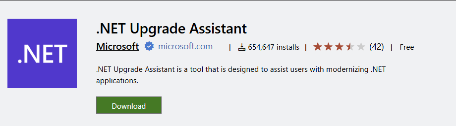
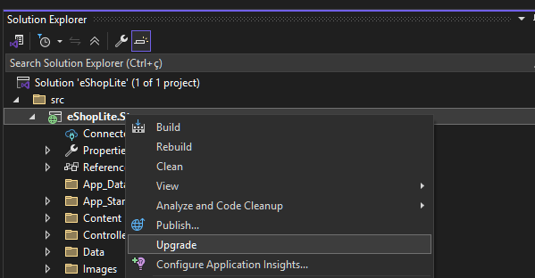
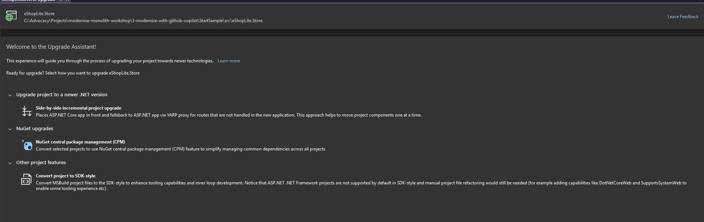
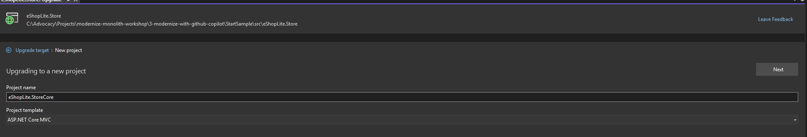
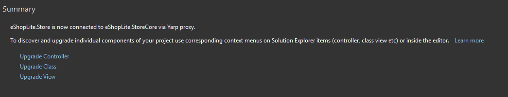
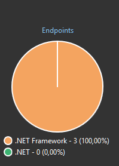
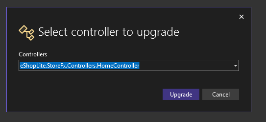

# 🔄 Migrate with .NET Upgrade Assistant

Let's update our eShopLite application to modern .NET using the .NET Upgrade Assistant. 

The .NET Upgrade Assistant is a powerful tool available as both a Visual Studio extension and command-line interface that helps migrate .NET Framework, .NET Core, or older .NET projects to the latest .NET version. 



Featuring an analysis engine that scans your projects and dependencies, generating detailed reports with upgrade recommendations that allow you to modernize entire projects or specific components like configuration files, while automatically detecting and fixing potential incompatibilities.

The following uses are supported by the extension:

### Supported Project Types

| Language Support | Project Types |
|------------------|---------------|
| **C# & Visual Basic** | ASP.NET, Azure Functions, WPF, Windows Forms, Class Libraries, Console Apps, Xamarin Forms, .NET MAUI, .NET Native UWP |

### Available Upgrade Paths

| From | To | Notes |
|------|----|----|
| .NET Framework | .NET | Full migration support |
| .NET Core | .NET | Version consolidation |
| Azure Functions v1-v3 | v4 isolated (net6.0+) | Modernized runtime |
| UWP | WinUI 3 | Windows app platform update |
| Previous .NET versions | Latest .NET | Always current |
| Xamarin Forms | .NET MAUI | Cross-platform evolution |

> **Note**: XAML transformations support namespace upgrades only. For comprehensive XAML changes, use Visual Studio 2022 v17.6+.


## 📋 What You'll Do

This section covers:

⬆️ Understanding the migration process  
🛠️ Using .NET Upgrade Assistant  
🎯 Complete transition from .NET Framework to .NET Core/.NET  
🔍 Analyzing migration results  

## ⬆️ Understanding the Migration Process

Let's learn how to migrate your application using the .NET Upgrade Assistant, for it we will use our Framework-based eShopLite application as an example.

Don't forget to **Install .NET Upgrade Assistant**, if you haven't already, install the .NET Upgrade Assistant from the Visual Studio Marketplace or as a global tool using the .NET CLI.

About the migration process, it typically involves the following steps:
- Analyzing the existing project structure and dependencies with the Upgrade Assistant. It can recommend to update the current project or to create a porting the old code to the Core version.
- Selecting the target .NET version for migration, such as .NET 9 or other supported versions. [See above](#available-upgrade-paths).
- Generating a migration report with recommended actions. It will provide which endpoints, could be updated by the Upgrade Assistant, plus some views and controllers that could be ported to the new version.
- Going to each part to apply the migration steps.
- Some parts of the code may require manual adjustments, especially if there are breaking changes or deprecated APIs in the new version, for example, if you are using the `EntityFramework` package, you will need to update it to the `Microsoft.EntityFrameworkCore` package.

## 🛠️ Using .NET Upgrade Assistant

Let's start the migration process by running the Upgrade Assistant on our eShopLiteFx application.

1. Open our sample project in Visual Studio 2022 or later.
2. Right-click on the solution in Solution Explorer and select **Upgrade**.

3. The Upgrade Assistant will give some option to how to upgrade the project, you can upgrade the entire project, just the packages, or to SDK-style project. Choose the option that best fits your needs, in our case we will select to do the side-by-side upgrade.

4. For this option, the Upgrade Assistant will give the option to create a new project in the same solution, or the same project, for our use case we need to create the new project, select the option to create a new project and give it a name, for example `eShopLite.StoreCore`.


5. Now, select the target for the new project, in our case we will select `.NET 9.0`, but you can select any other supported version.

6. The Upgrade Assistant will start analyzing the project and will give you a report with the summary of the migration, and start to apply the necessary changes.


7. Once the migration is complete, you will need to upgrade some other parts of the code, like the controllers, views, and some individual classses.



8. The Upgrade Assistant will give you a list of controllers, views, and other components that could be updated, you can select the ones you want to update, and it will apply the necessary changes. In our case, select the only controller that is available, the Data classes, and check if the views are already in your project, if not, you can select them to be updated. Keep in mind that this may take some time, depending on the size of your project.
9. 



10. After this, please copy and paste the scripts and the images folder from the old project to the new project, as the Upgrade Assistant does not copy these files automatically.

With these steps, you should have partially migrated your eShopLiteFx application to a new .NET Core project. However, there are still some manual steps to complete the migration, let's continue with them.

## 🎯 Complete Transition from .NET Framework to .NET Core/.NET

After running the Upgrade Assistant, you will have a new project in your solution that is based on .NET Core/.NET. However, there are still some manual steps to complete the migration:

1. **Install the necessary NuGet packages**: The Upgrade Assistant will not install all the necessary packages, so you will need to install them manually. For example, you will need to install the `Microsoft.EntityFrameworkCore` and `Newtonsoft.Json` packages, and any other package that your project depends on.
2. **Check if the files are importing the correct libraries**: The Upgrade Assistant will not update the using statements in your files, so you will need to check if the files are importing the correct libraries. Use Visual Studio "Use Local xxx library" feature to update the using statements.
3. **Change the namespaces**: The Upgrade Assistant will not change the namespaces in your files, so you will need to change them manually. For example, in the `Store Service` and in the `Data Service` classes, you will need to change the namespaces to match the new project name. In our case, we will change the namespaces from `eShopLiteFx` to `eShopLite.StoreCore`.
4. **Update the `program.cs file**: Inject both `StoreService` and `DataService` in the `program.cs` file, as the Upgrade Assistant will not do this automatically. You can use the following code to do this:

```csharp
// Add services to the container.
builder.Services.AddControllersWithViews();

// Add Entity Framework Core with In-Memory database
builder.Services.AddDbContext<StoreDbContext>(options =>
    options.UseInMemoryDatabase("StoreDatabase"));

// Add StoreService and DbContext
builder.Services.AddScoped<IStoreService, StoreService>();
builder.Services.AddScoped<IStoreDbContext>(provider => provider.GetService<StoreDbContext>()!);

var app = builder.Build();

// Ensure database is created
using (var scope = app.Services.CreateScope())
{
    var context = scope.ServiceProvider.GetRequiredService<StoreDbContext>();
    context.Database.EnsureCreated();
}
```
5. **Update the database to use Entity Framework Core**: The Upgrade Assistant will not update the database to use Entity Framework Core, so you will need to do this manually. You can use the following code to do this:

```csharp
using System.Collections.Generic;
using Microsoft.EntityFrameworkCore;
using eShopLite.StoreFx.Models;

namespace eShopLite.StoreCore.Data
{
    public interface IStoreDbContext
    {
        DbSet<Product> Products { get; set; }
        DbSet<StoreInfo> Stores { get; set; }
        int SaveChanges();
    }

    public class StoreDbContext : DbContext, IStoreDbContext
    {
        public StoreDbContext(DbContextOptions<StoreDbContext> options) : base(options)
        {
        }

        public DbSet<Product> Products { get; set; }
        public DbSet<StoreInfo> Stores { get; set; }

        protected override void OnModelCreating(ModelBuilder modelBuilder)
        {
            base.OnModelCreating(modelBuilder);

            // Seed data
            var products = new List<Product>
            {
                new Product { Id = 1, Name = "Solar Powered Flashlight", Description = "A fantastic product for outdoor enthusiasts", Price = 19.99m, ImageUrl = "product1.png" },
                new Product { Id = 2, Name = "Hiking Poles", Description = "Ideal for camping and hiking trips", Price = 24.99m, ImageUrl = "product2.png" },
                new Product { Id = 3, Name = "Outdoor Rain Jacket", Description = "This product will keep you warm and dry in all weathers", Price = 49.99m, ImageUrl = "product3.png" },
                new Product { Id = 4, Name = "Survival Kit", Description = "A must-have for any outdoor adventurer", Price = 99.99m, ImageUrl = "product4.png" },
                new Product { Id = 5, Name = "Outdoor Backpack", Description = "This backpack is perfect for carrying all your outdoor essentials", Price = 39.99m, ImageUrl = "product5.png" },
                new Product { Id = 6, Name = "Camping Cookware", Description = "This cookware set is ideal for cooking outdoors", Price = 29.99m, ImageUrl = "product6.png" },
                new Product { Id = 7, Name = "Camping Stove", Description = "This stove is perfect for cooking outdoors", Price = 49.99m, ImageUrl = "product7.png" },
                new Product { Id = 8, Name = "Camping Lantern", Description = "This lantern is perfect for lighting up your campsite", Price = 19.99m, ImageUrl = "product8.png" },
                new Product { Id = 9, Name = "Camping Tent", Description = "This tent is perfect for camping trips", Price = 99.99m, ImageUrl = "product9.png" },
            };

            modelBuilder.Entity<Product>().HasData(products);

            var stores = new List<StoreInfo>()
            {
                new StoreInfo { Id = 1, Name = "Outdoor Store", City = "Seattle", State = "WA", Hours = "9am - 5pm" },
                new StoreInfo { Id = 2, Name = "Camping Supplies", City = "Portland", State = "OR", Hours = "10am - 6pm" },
                new StoreInfo { Id = 3, Name = "Hiking Gear", City = "San Francisco", State = "CA", Hours = "11am - 7pm" },
                new StoreInfo { Id = 4, Name = "Fishing Equipment", City = "Los Angeles", State = "CA", Hours = "8am - 4pm" },
                new StoreInfo { Id = 5, Name = "Climbing Gear", City = "Denver", State = "CO", Hours = "9am - 5pm" },
                new StoreInfo { Id = 6, Name = "Cycling Supplies", City = "Austin", State = "TX", Hours = "10am - 6pm" },
                new StoreInfo { Id = 7, Name = "Winter Sports Gear", City = "Salt Lake City", State = "UT", Hours = "11am - 7pm" },
                new StoreInfo { Id = 8, Name = "Water Sports Equipment", City = "Miami", State = "FL", Hours = "8am - 4pm" },
                new StoreInfo { Id = 9, Name = "Outdoor Clothing", City = "New York", State = "NY", Hours = "9am - 5pm" }
            };

            modelBuilder.Entity<StoreInfo>().HasData(stores);
        }
    }
}
```

7. Lastly, update the layout to use the new components and styles.

```html
  Under the title tag
  <link href="~/Content/bootstrap.min.css" rel="stylesheet" />
  <link href="~/Content/Site.css" rel="stylesheet" />
  Change the scripts to
  <script src="~/Scripts/jquery-3.7.1.min.js"></script>
  <script src="~/Scripts/bootstrap.bundle.min.js"></script>
  @RenderSection("scripts", required: false)
```

Now, you should be able to run the application and see the migrated eShopLite.StoreCore application running on .NET Core/.NET. If you wish, you could delete the old eShopLiteFx project, as it is no longer needed.


>**Note**: For the complete migration for the sample, look at the [eShopLite.StoreCore](../3-modernize-with-github-copilot/StartSample) folder, which contains the fully migrated project.

## ✅ Verification

By the end of this section, you should have:

🔹 Successfully migrated your application to modern .NET  
🔹 Understanding of common migration patterns  
🔹 A working modern .NET application  

---
[← Previous: Setup Environment](../1-setup-your-environment/README.md) | [Next: Modernize with GitHub Copilot →](../3-modernize-with-github-copilot/README.md)
