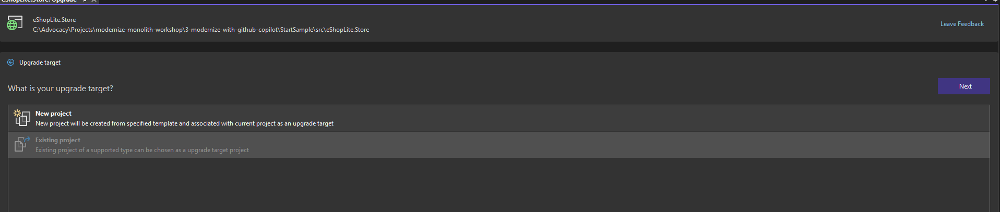
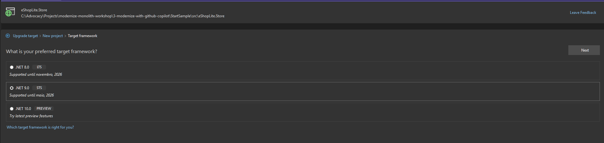
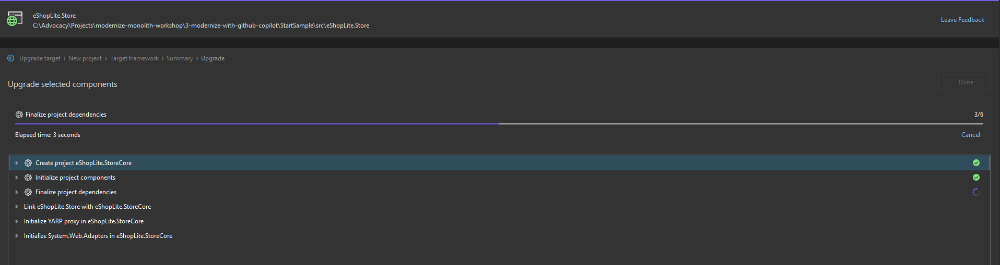
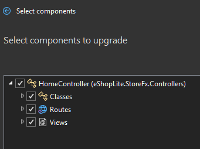
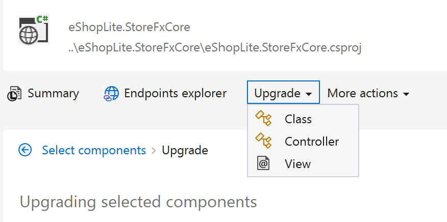

# 🔄 Upgrade with .NET Upgrade Assistant

Let's upgrade our eShopLite application to modern .NET using the .NET Upgrade Assistant. 

The .NET Upgrade Assistant is a powerful tool available as both a Visual Studio extension and command-line interface that helps migrate .NET Framework, .NET Core, to the latest .NET version. 


The Upgrade Assistant features an analysis engine that scans your projects and dependencies, then generates detailed reports with upgrade recommendations. It helps you upgrade entire projects or specific components, like configuration files, and automatically detects and fixes potential incompatibilities.

The following use cases are supported by the extension:

### Supported project types

| Language Support | Project Types |
|------------------|---------------|
| **C# & Visual Basic** | ASP.NET, Azure Functions, WPF, Windows Forms, Class Libraries, Console Apps, Xamarin Forms, .NET MAUI, .NET Native UWP |

### Available upgrade paths

| From | To | Notes |
|------|----|----|
| .NET Framework | .NET | Full migration support |
| .NET Core | .NET | Version consolidation |
| Azure Functions v1-v3 | v4 isolated (net6.0+) | Modernized runtime |
| UWP | WinUI 3 | Windows app platform update |
| Previous .NET versions | Latest .NET | Always current |
| Xamarin Forms | .NET MAUI | Cross-platform evolution |

> **Note**: XAML transformations support namespace upgrades only. For comprehensive XAML changes, use Visual Studio 2022 v17.6+.


## 📋 What you'll do

This section covers:

⬆️ Understand the modernization process  
🛠️ Use .NET Upgrade Assistant  
🎯 Complete modernization from .NET Framework to .NET Core/.NET  
🔍 Analyze the modernization results  

## ⬆️ Understanding the modernization process

When modernizing a codebase with the .NET Upgrade Assistant, several key activities are involved:

- **Project analysis and scanning**: The tool includes an analysis engine that scans your projects and their dependencies to identify upgrade opportunities and potential incompatibilities
- **Automated project format conversion**: Upgrades projects from the .NET Framework project format to the latest .NET SDK project format automatically
- **NuGet package cleanup and optimization**: Analyzes package references and removes unnecessary dependencies while ensuring proper package versions for the target framework
- **Target framework migration**: Changes the target framework moniker (TFM) from .NET Framework to the appropriate modern .NET version (such as net6.0 or net9.0)
- **Code transformation and namespace updates**: Performs source-specific code changes, updates namespaces, and migrates APIs to their modern equivalents
- **Configuration file migration**: Updates configuration files from older formats to newer types compatible with modern .NET
- **Analyzer integration**: Adds analyzers to the project that assist with completing the migration process and identifying remaining issues
- **Task list generation**: Creates TODO items in Visual Studio's Task List for manual migration tasks that require developer attention
- **Side-by-side or in-place upgrade options**: Offers flexibility to either create a copy of your project for migration or upgrade the existing project in place
- **Template and boilerplate file generation**: Adds or updates necessary template, config, and code files required for the target platform
- **Checking the work**: You may need to check the work or manually do adjustments to make sure everything works as you'd expect.

## 🛠️ Using .NET Upgrade Assistant

> 🪧**IMPORTANT**
>
> **Windows Path Length Limitation**: If you encounter NuGet package restore errors, this is likely due to Windows path length restrictions. To resolve this, copy the starter solution to a shorter path such as `C:\Dev` to ensure optimal performance during the upgrade process.

> 🪧**IMPORTANT**
>
> If you encounter an error similar to the followng while trying to debug:
> 
> 
> Run the following command in the **NuGet Package Manager Console** (Open via the menu: **Tools > NuGet Package Manager > Package Manager Console**)
> 
> `Update-Package Microsoft.CodeDom.Providers.DotNetCompilerPlatform -r`

Let's start the migration process by running the Upgrade Assistant on our eShopLiteFx (.NET Framework) application.

1. Open our sample project in Visual Studio 2022.

1. Right-click on the solution in Solution Explorer and select **Upgrade**.

    

1. The Upgrade Assistant will give some options to how to upgrade the project, you can upgrade the entire project. We'll select the **side-by-side** upgrade.

    

1. Then select **New Project** for the upgrade target. 

    

1. Give it a name, for example **eShopLite.StoreCore**. You can leave the **Project template** as **ASP.NET Core MVC**.

    

1. Select **.NET 9.0** for the target framework if you have that installed. If not select **.NET 8**.

    

1. The Upgrade Assistant will start analyzing the project and will give you a report with the summary of the changes it needs to make to complete the migration. Click **Finish** to run the migration.

    

    

1. Once the migration is complete click the **Done** button. Now any communications coming to the new .NET application will be proxied from the new .NET 9 application through to the existing .NET Framework application. However, you will need to upgrade some other parts of the code, like the controllers, views, and some individual classses. You can click on the individual links **Upgrade Controller**, **Upgrade Class** and **Upgrade View** to perform those upgrades.

    

    

1. If you click on any of those links, you'll see a list of controllers, views, and other components that could be upgraded. Click **Upgrade Controller** and then select **eShopLite.StoreFx.Controllers.HomeController**. (Keep everything checked below it.)

    

    

1. Click **Upgrade Selection** and the Assistant will go through and upgrade the controller. A report will appear with success, skipped, and failures.

1. Now select **Upgrade > Class** from the dropdown on the top menu bar of the assistant.

    

1. One by one, go through and select all of the data classes to upgrade them.

    

1. After this, please copy and paste the scripts and the images folder from the old project to the new project, as the Upgrade Assistant does not copy these files automatically.

With these steps, you have partially modernized the eShopLite .NET Framework application to a new .NET Core project. However, there are still some manual steps to complete the migration, let's continue with them.

## 🎯 Complete modernization from .NET Framework to .NET Core/.NET

After running the Upgrade Assistant, you will have a new project in your solution that is based on .NET Core/.NET. However, there are still some manual steps to complete the migration:

# MATT NOTES
> Instead of step by step instructions, since there will be many, let's create a new folder and have the updated files in there so people can copy them in. Then for each file list the things that were changes. 
> To do this, create a custom copilot commit instruction that tells it to list every file and then sum up the changes that were made to the file. I think that's probably the easiest(??)

1. **Install the necessary NuGet packages**: The Upgrade Assistant will not install all the necessary packages, so you will need to install them manually. Install the `Microsoft.EntityFrameworkCore` and `Newtonsoft.Json` packages, and any other package that your project depends on.

1. **Check if the files are importing the correct libraries**: The Upgrade Assistant will not update the using statements in your files. This means you need to go through any files throwing exceptions and update the `using` statements. The **quick fix** (`ctrl+.`) function is great for this.

1. **Change the namespaces**: The Upgrade Assistant will not change the namespaces in your files, so you will need to change them manually. For example, in the `Store Service` and in the `Data Service` classes, you will need to change the namespaces to match the new project name. In our case, we will change the namespaces from `eShopLiteFx` to `eShopLite.StoreCore`.

1. **Update the `program.cs file**: Inject both `StoreService` and `DataService` in the `program.cs` file, as the Upgrade Assistant will not do this automatically. You can use the following code to do this:

    ```csharp
    // Add services to the container.
    builder.Services.AddControllersWithViews();

    // Add Entity Framework Core with In-Memory database
    builder.Services.AddDbContext<StoreDbContext>(options =>
        options.UseInMemoryDatabase("StoreDatabase"));

    // Add StoreService and DbContext
    builder.Services.AddScoped<IStoreService, StoreService>();
    builder.Services.AddScoped<IStoreDbContext>(provider => provider.GetService<StoreDbContext>()!);

    var app = builder.Build();

    // Ensure database is created
    using (var scope = app.Services.CreateScope())
    {
        var context = scope.ServiceProvider.GetRequiredService<StoreDbContext>();
        context.Database.EnsureCreated();
    }
    ```

1. **Update the database to use Entity Framework Core**: The Upgrade Assistant will not update the database to use Entity Framework Core, so you will need to do this manually. You can use the following code to do this:

    ```csharp
    using System.Collections.Generic;
    using Microsoft.EntityFrameworkCore;
    using eShopLite.StoreFx.Models;

    namespace eShopLite.StoreCore.Data
    {
        public interface IStoreDbContext
        {
            DbSet<Product> Products { get; set; }
            DbSet<StoreInfo> Stores { get; set; }
            int SaveChanges();
        }

        public class StoreDbContext : DbContext, IStoreDbContext
        {
            public StoreDbContext(DbContextOptions<StoreDbContext> options) : base(options)
            {
            }

            public DbSet<Product> Products { get; set; }
            public DbSet<StoreInfo> Stores { get; set; }

            protected override void OnModelCreating(ModelBuilder modelBuilder)
            {
                base.OnModelCreating(modelBuilder);

                // Seed data
                var products = new List<Product>
                {
                    new Product { Id = 1, Name = "Solar Powered Flashlight", Description = "A fantastic product for outdoor enthusiasts", Price = 19.99m, ImageUrl = "product1.png" },
                    new Product { Id = 2, Name = "Hiking Poles", Description = "Ideal for camping and hiking trips", Price = 24.99m, ImageUrl = "product2.png" },
                    new Product { Id = 3, Name = "Outdoor Rain Jacket", Description = "This product will keep you warm and dry in all weathers", Price = 49.99m, ImageUrl = "product3.png" },
                    new Product { Id = 4, Name = "Survival Kit", Description = "A must-have for any outdoor adventurer", Price = 99.99m, ImageUrl = "product4.png" },
                    new Product { Id = 5, Name = "Outdoor Backpack", Description = "This backpack is perfect for carrying all your outdoor essentials", Price = 39.99m, ImageUrl = "product5.png" },
                    new Product { Id = 6, Name = "Camping Cookware", Description = "This cookware set is ideal for cooking outdoors", Price = 29.99m, ImageUrl = "product6.png" },
                    new Product { Id = 7, Name = "Camping Stove", Description = "This stove is perfect for cooking outdoors", Price = 49.99m, ImageUrl = "product7.png" },
                    new Product { Id = 8, Name = "Camping Lantern", Description = "This lantern is perfect for lighting up your campsite", Price = 19.99m, ImageUrl = "product8.png" },
                    new Product { Id = 9, Name = "Camping Tent", Description = "This tent is perfect for camping trips", Price = 99.99m, ImageUrl = "product9.png" },
                };

                modelBuilder.Entity<Product>().HasData(products);

                var stores = new List<StoreInfo>()
                {
                    new StoreInfo { Id = 1, Name = "Outdoor Store", City = "Seattle", State = "WA", Hours = "9am - 5pm" },
                    new StoreInfo { Id = 2, Name = "Camping Supplies", City = "Portland", State = "OR", Hours = "10am - 6pm" },
                    new StoreInfo { Id = 3, Name = "Hiking Gear", City = "San Francisco", State = "CA", Hours = "11am - 7pm" },
                    new StoreInfo { Id = 4, Name = "Fishing Equipment", City = "Los Angeles", State = "CA", Hours = "8am - 4pm" },
                    new StoreInfo { Id = 5, Name = "Climbing Gear", City = "Denver", State = "CO", Hours = "9am - 5pm" },
                    new StoreInfo { Id = 6, Name = "Cycling Supplies", City = "Austin", State = "TX", Hours = "10am - 6pm" },
                    new StoreInfo { Id = 7, Name = "Winter Sports Gear", City = "Salt Lake City", State = "UT", Hours = "11am - 7pm" },
                    new StoreInfo { Id = 8, Name = "Water Sports Equipment", City = "Miami", State = "FL", Hours = "8am - 4pm" },
                    new StoreInfo { Id = 9, Name = "Outdoor Clothing", City = "New York", State = "NY", Hours = "9am - 5pm" }
                };

                modelBuilder.Entity<StoreInfo>().HasData(stores);
            }
        }
    }
    ```

1. Lastly, update the layout to use the new components and styles.

    ```html
    Under the title tag
    <link href="~/Content/bootstrap.min.css" rel="stylesheet" />
    <link href="~/Content/Site.css" rel="stylesheet" />
    Change the scripts to
    <script src="~/Scripts/jquery-3.7.1.min.js"></script>
    <script src="~/Scripts/bootstrap.bundle.min.js"></script>
    @RenderSection("scripts", required: false)
    ```

1. If a database migration wasn't created, you can create it manually by running the following command in the terminal:

    ```bash
    dotnet ef migrations add InitialCreate
    dotnet ef database update
    ```

Now, you should be able to run the application and see the migrated eShopLite.StoreCore application running on .NET Core/.NET. If you wish, you could delete the old eShopLiteFx project, as it is no longer needed.


>**Note**: For the complete migration for the sample, look at the [eShopLite.StoreCore](../../3-modernize-with-github-copilot/StartSample) folder, which contains the fully migrated project.

# END OF MATT NOTES

---

## ✅ Wrap-up

By the end of this section, you should have:

🔹 Successfully migrated your application to modern .NET  
🔹 Understanding of common migration patterns  
🔹 A working modern .NET application  

[← Previous: Upgrade .NET Applications](../README.md) | [Next: Modernize with GitHub Copilot →](../../3-modernize-with-github-copilot/README.md)
