# 🤖 Modernize with GitHub Copilot

Now, we successfully ported our eShopLite application to .NET Core in the previous section. However, it still has room for improvement, as it may not fully utilize the latest .NET 9 features and best practices.

In this section, we will modernize our application using GitHub Copilot, which will assist us in refactoring the codebase, improving architecture, and enhancing overall performance.

## 📋 What You'll Do

This section explores:

🚀 AI-powered code modernization  
💡 GitHub Copilot best practices  
🔧 Automated refactoring suggestions  
📈 Improving code quality with AI assistance  

> Important Note: For this section, please use the sample in the StartSample folder, as the previous samples both in 2 and 2b may have different results while migrating from .NET Framework.

## 📚 Instructions

Let's leverage GitHub Copilot to modernize our migrated eShopLite application, transforming it from a basic .NET Core port to a fully modernized .NET 9 application following current best practices.

### 🔍 Prerequisites

Before starting, ensure you have:
- GitHub Copilot installed and activated in Visual Studio
- The "migrate_dotnet" tool enabled in Agent Mode (If not, install the GitHub Copilot Modernization for .NET extension)
- The project from the StartSample folder

### Check GitHub Copilot Agent Mode

First, verify that the migrate_dotnet tool is enabled in GitHub Copilot's Agent Mode:

1. Open Visual Studio and navigate to your solution
2. Ensure Agent Mode is active with the migrate_dotnet tool enabled

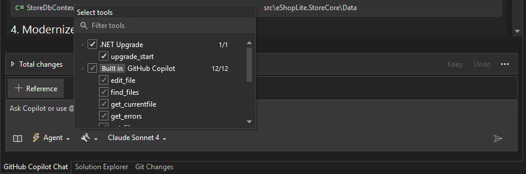

### Starting the Modernization Process

1. **Right-click on your solution** in Solution Explorer
2. Select **"Upgrade with Copilot"** from the context menu

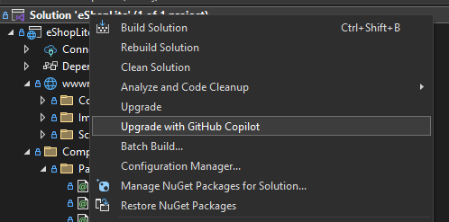

3. When prompted to select a version or provide context, do not select a version. Because we did already the migration in the previous section, here, we are aiming to modernize the application architecture and codebase.

4. Paste the following comprehensive modernization request:

```
I am working on a project that has recently been upgraded from .NET Framework to .NET 9. I need help modernizing the architecture and refactoring the codebase to align with .NET 9 best practices. Please assist with the following tasks:

Namespace and Naming Consistency
Scan the entire solution for inconsistent or outdated namespace declarations. Identify and correct naming inconsistencies in classes, methods, and files. Apply consistent naming conventions throughout the codebase. The steps will be: Namespace and Naming Consistency, Fix Namespace Consistency - Models

Architecture Modernization
Refactor legacy architectural patterns to modern .NET 9 standards. Introduce dependency injection using Microsoft.Extensions.DependencyInjection. Replace obsolete or deprecated APIs with .NET 9-compatible alternatives. The steps will be: Modernize Data Layer with SQLite, Modernize Service Layer, Fix Controller Namespace and Modernize, Modernize Program.cs with .NET 9 Best Practices, Update Views to Handle Async Operations and New Namespaces, Create Error View

Database Migration
Replace the existing SQLExpress database with SQLite. Update connection strings and DbContext configuration to support SQLite. Migrate schema and seed data from SQLExpress to SQLite. Ensure all SQL queries are compatible with SQLite syntax. The steps will be: Update Configuration with SQLite Connection String, Create the database, Build and Test the Application
```

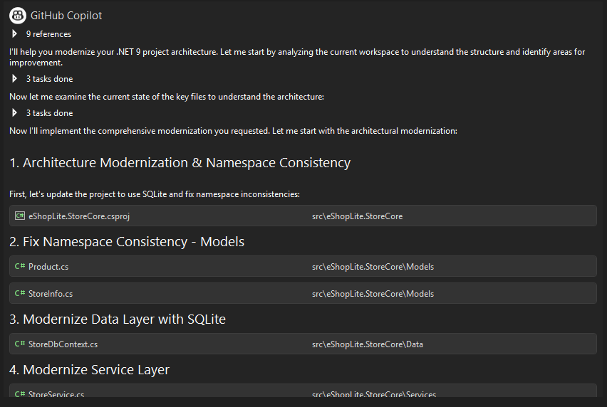

### 📝 Modernization Steps

GitHub Copilot will guide you through several modernization phases:

#### 1️⃣ Namespace and Naming Consistency

Because of the older namespace structure from .NET Framework, we need to ensure that all namespaces and naming conventions are consistent in our application. For example, our models may have namespaces like `eShopLite.StoreFx.Models` instead of `eShopLite.StoreCore.Models`.

To achieve this, we added steps to Copilot analyze your codebase and suggest namespace corrections, before accepting any changes, please follow these steps:

- Review suggested namespace changes, you can accept or modify them as needed.
- Accept modifications to align with .NET 9 conventions and packages, such as going from `Newtonsoft.Json` to `System.Text.Json`.
- Ensure all models follow consistent naming patterns

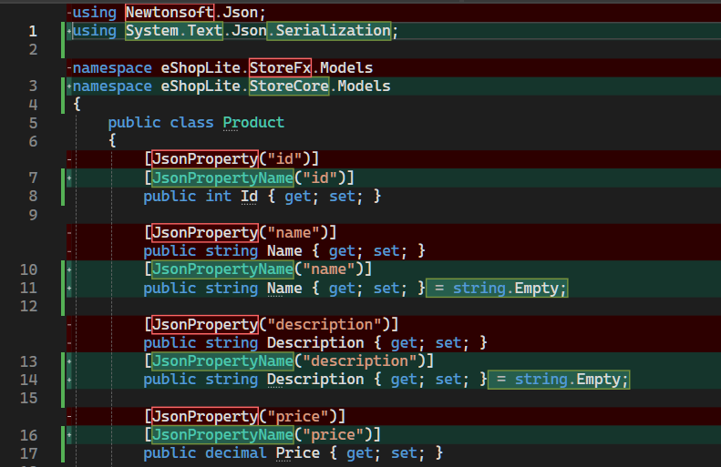

#### 2️⃣ Architecture Modernization

##### Modernize Data Layer with SQLite

We are transitioning from SQL Express using InMemory to SQLite, thus using a real database for persistence. Copilot will help transition from SQL Express to SQLite:

- Update Entity Framework Core packages
- Configure SQLite provider
- Adjust connection strings

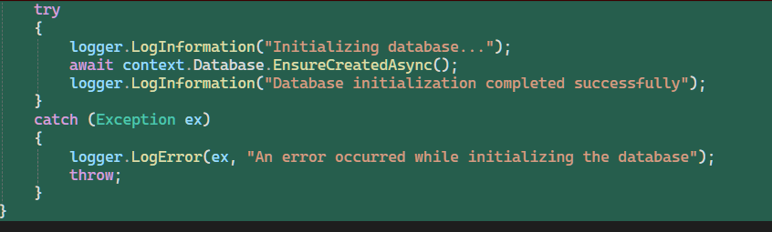

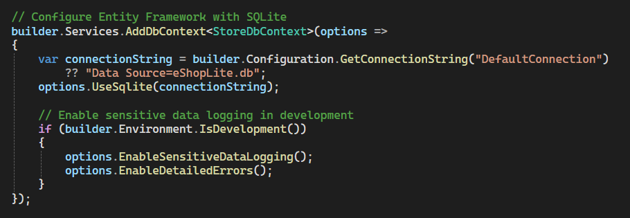

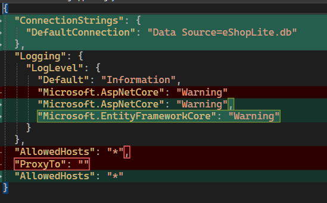

##### Modernizations

Transform services to use modern dependency injection patterns and update controllers with async/await patterns and modern routing:

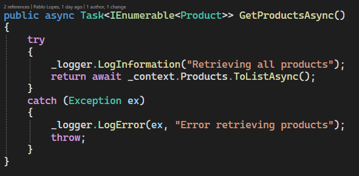

#### 3️⃣ Database Migration

Copilot should automatically handle the database migration to SQLite, but if it doesn't, you can follow these steps:

1. Open a terminal in your project directory
2. Run the following commands:

```bash
cd eShopLite.StoreCore
dotnet ef migrations add InitialCreate
```

3. Now, build and run the application to ensure the database is created and seeded correctly.

### 🔧 Troubleshooting Common Issues

#### YARP Errors

If you encounter YARP (Yet Another Reverse Proxy) errors:
- Ask Copilot to remove YARP references from your project
- These are typically not needed for this application

#### Missing Images

If product images don't appear after modernization:
- Ask Copilot to reorganize static files within the `wwwroot` folder
- Ensure image paths are correctly referenced

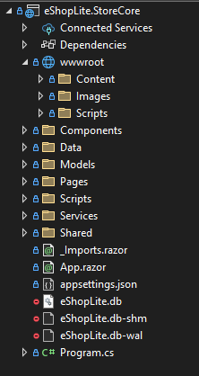

### 🎯 Build and Test

After completing all modernization steps:

1. Build the solution to ensure no compilation errors
2. Run the application and verify all functionality
3. Check that:
   - Database operations work with SQLite
   - All pages load correctly
   - Images and static content display properly
   - Async operations complete successfully


### 4️⃣ Convert to Blazor Pages

Great, now we are ready continuing our modernization journey by converting the existing ASP.NET MVC pages to Blazor components. Use the following prompt to guide Copilot:

```plaintext
Convert the existing ASP.NET MVC pages to Blazor components. This includes:

Convert all existing pages to use Blazor (preferably Blazor Server or Blazor WebAssembly, depending on suitability).
Remove all non-Blazor pages and ensure routing is correctly configured.
Ensure all media (images, videos, etc.) are correctly referenced and rendered in the new Blazor components.
Fix issues where the page renders blank or fails to load due to routing or layout problems.
```

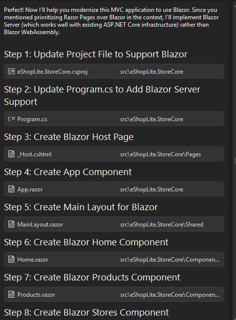

Copilot will convert the MVC pages to Blazor components, ensuring that all functionality is preserved and adding some new features.

> Note: If you encounter any issues with the Blazor migration, you can ask Copilot to help troubleshoot specific problems, such as missing components or routing errors.

This is our final page:

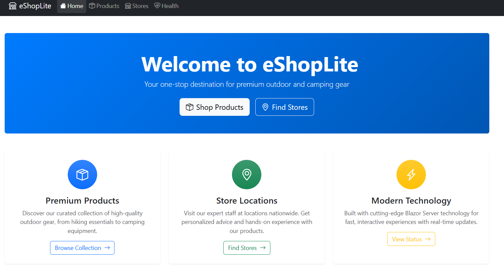


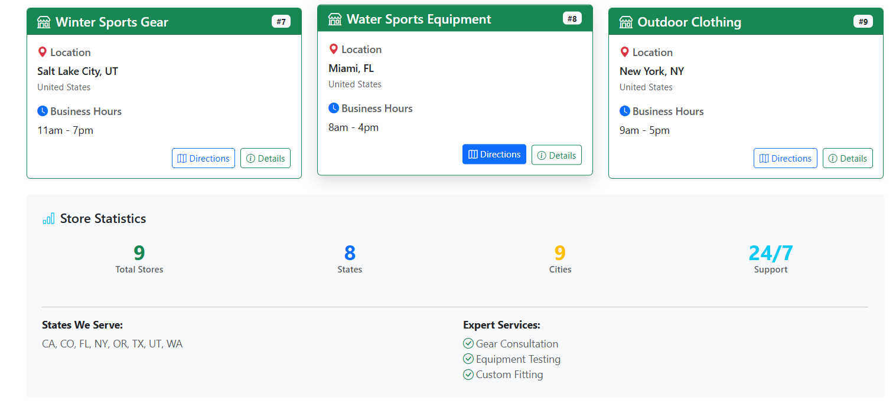


## ✅ Verification

By the end of this section, you should have:

🔹 Leveraged GitHub Copilot for code improvements  
🔹 Applied modern coding patterns  
🔹 Enhanced application performance and maintainability  

---
[← Previous: Modernize .NET Applications](../2-modernize-dotnet/README.md) | [Next: Refactor into Microservices →](../4-refactor-into-microservices/README.md)