# ⭐ Add .NET Aspire

Enhance your microservices with .NET Aspire for service discovery, comprehensive telemetry, and simplified orchestration across your distributed application.

## 📋 What You'll Do

This section introduces:

🔍 Service discovery implementation  
📊 Dashboard and telemetry setup  
🎛️ Application orchestration  
📈 Monitoring and observability  

## 📚 Instructions

### Run `eShopLite` application

First let's run the eShopLite application to see what it looks like before adding Aspire.

1. Open Visual Studio 2022.
1. Open the **eShopLite** solution from the **5-add-dotnet-aspire/StartSample** folder.
1. Right click on the solution node in Solution Explorer and select **Configure Startup Projects**. Select **Multiple startup projects** and set the **eShopLite.Store**, **eShopLite.Products** and **eShopLite.StoreInfo** projects to **Start**, and each project's debug target to **https**, then Click **OK**.

   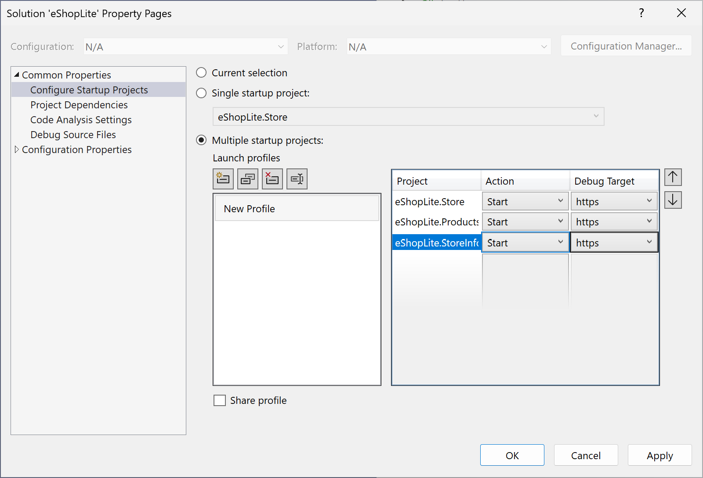

1. Press **F5** or the **Start** button to start debugging the application.
1. Three web browsers will open, one for the **eShopLite.Products** project, another for the **eShopLite.StoreInfo** project and the other for the **eShopLite.Store** project. The browser screens for both **eShopLite.Products** and **eShopLite.StoreInfo** will display 404 error, which is expected. But the other web browser screen for **eShopLite.Store** will display the webpage. Click on both **Products** and **Stores** links at the top navigation bar to see the list of products or store locations appearing.

   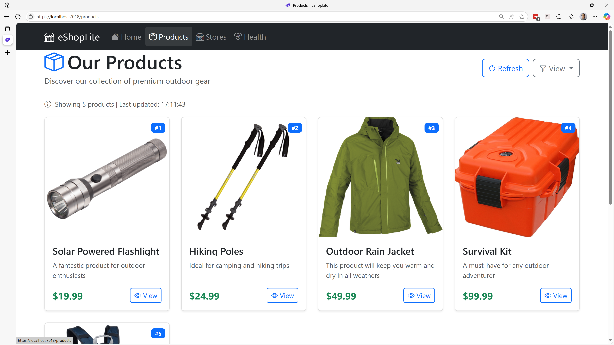
   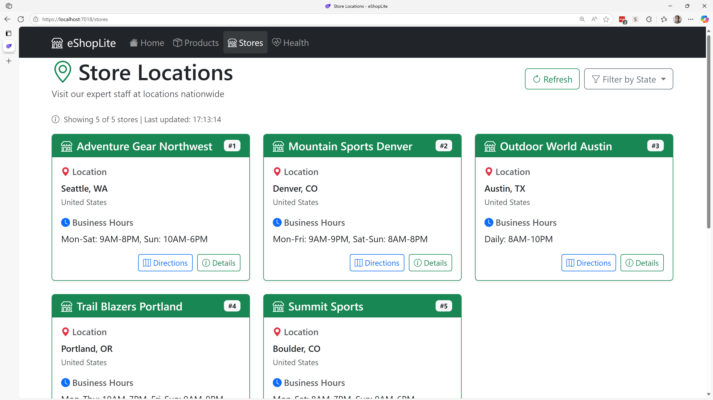

1. Close the web browsers to stop debugging the applications.

Both **eShopLite.Products** and **eShopLite.StoreInfo** projects are the backend services that provide a list of products and store information. The **eShopLite.Store** project is a frontend web application that displays the products from the **eShopLite.Products** API and store information from the **eShopLite.StoreInfo** API. Those three apps are considered as microservices, and it's easy to imagine adding additional microservices to the application, for example a **Cart** microservice.

In the microservices architecture, how do each microservice app find each other? Let's open `Program.cs` from ****eShopLite.Store**** and see how it's set this up.

```csharp
builder.Services.AddHttpClient<IProductApiClient, ProductApiClient>(client =>
{
    client.BaseAddress = new Uri(builder.Configuration.GetValue<string>("ProductsApiUrl") ?? "https://localhost:7001");
});

builder.Services.AddHttpClient<IStoreInfoApiClient, StoreInfoApiClient>(client =>
{
    client.BaseAddress = new Uri(builder.Configuration.GetValue<string>("StoreInfoApiUrl") ?? "https://localhost:7002");
});
```

Each endpoint is defined in `appsettings.json` like `ProductsApiUrl` or `StoreInfoApiUrl`. What if there are more microservice apps added? Should we add more configuration values like `XXXApiUrl`? How many configurations can we keep? The more microservice apps are added, the more complex the app gets for maintenance.

What about service availability for each microservice app? Although one app is down, the entire system should be up and running, while fixing the defected service. How can we actively monitor those? How can we actively make them resilient?

We need to sort out these maintenance overheads.

### What is .NET Aspire?

A cloud-native application is a web application built from small microservices, which make use of common services such as messaging queues to communicate or caches to optimize performance. Cloud-native applications are proven and widely implemented but they can be difficult to architect and build. Since .NET 8, it includes the new .NET Aspire stack, which makes it easier to build cloud-native applications by providing service discovery, common components in NuGet packages, and simple tools for both coding and monitoring apps.

It helps solve some of the common challenges in building cloud-native applications by providing tooling for:

- **Orchestration** 👉 clearly specify the projects, containers, and services that make up your application. .NET Aspire can then use service discovery to find and connect these services.
- **Integrations** 👉 many projects need common components for integration like data storage, caching, and messaging. .NET Aspire provides a standard interface that your application can use to access these components regardless of the underlying implementation.
- **Dashboard** 👉 the .NET Aspire dashboard lets you monitor all the services that compose your application in one place. Including console logs, structured logs, traces, and metrics.

Let's add in .NET Aspire to the **eShopLite** application with an eye towards enabling service discovery.

### Adding .NET Aspire to the eShopLite application

1. Back in Visual Studio, right-click the **eShopLite.Store** project, select **Add**, and then select **.NET Aspire Orchestrator Support** and then select **Ok**.

   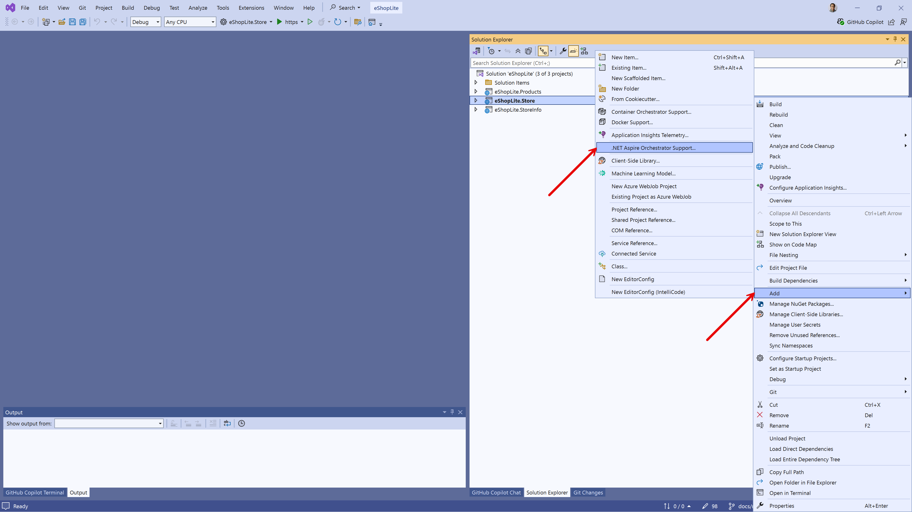

1. Two new projects will be added to the solution:

   - **eShopLite.AppHost**
   - **eShopLite.ServiceDefaults**

   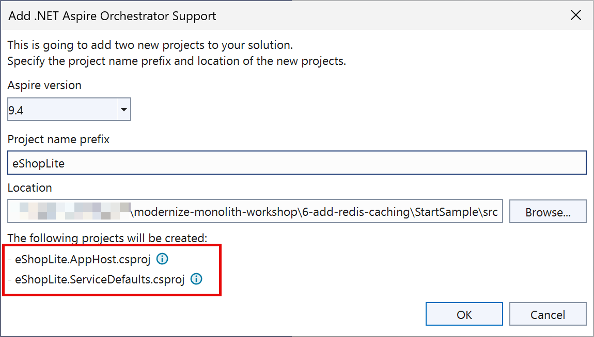

   The **AppHost** and **ServiceDefaults** projects are the core of every .NET Aspire application. The **AppHost** project is the entry point and is responsible for acting as the orchestrator.

   The **ServiceDefaults** project contains the default configuration for the application. These configurations are reused across all the projects in your solution.

1. Open the **AppHost.cs** file from the **eShopLite.AppHost** project.
1. Verify the following line of code which adds the **eShopLite.Store** project the the Aspire orchestration:

    ```csharp
    builder.AddProject<Projects.eShopLite_Store>("eshoplite-store");
    ```

1. To add the **eShopLite.Products** project to the Aspire orchestration, right-click on the **eShopLite.Products** project, select **Add**, and then select **.NET Aspire Orchestrator Support**.

   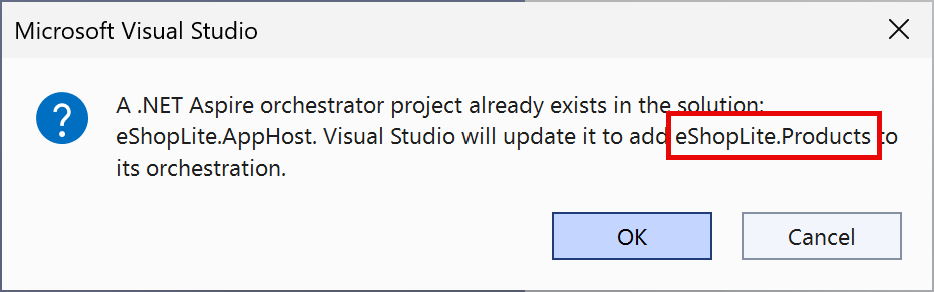

   A warning will appear indicating that the solution already has Aspire support. Select **Yes** to add the project to the orchestration.

   Repeat this step against the **eShopLite.StoreInfo** project to the Aspire orchestration.

1. Verify the following line of code from the **AppHost.cs** file from the **eShopLite.AppHost** project, which adds both **eShopLite.Products** and **eShopLite.StoreInfo** project the the Aspire orchestration:

    ```csharp
    builder.AddProject<Projects.eShopLite_Products>("eshoplite-products");

    builder.AddProject<Projects.eShopLite_StoreInfo>("eshoplite-storeinfo");
    ```

1. Open the `Program.cs` file from any of **eShopLite.Products**, **eShopLite.StoreInfo** or **eShopLite.Store** project. It has these two lines of codes:

    ```csharp
    ...

    var builder = WebApplication.CreateBuilder(args);
    
    builder.AddServiceDefaults(); // 👈 This line
    
    ...
    
    var app = builder.Build();
    
    app.MapDefaultEndpoints(); // 👈 This line
    
    ...
    ```

   The `AddServiceDefaults()` method is defined in the `Extensions.cs` file from the **eShopLite.ServiceDefaults** project, which configures OpenTelemetry, service discovery, health check and resiliency.

   The `MapDefaultEndpoints()` method is defined in the `Extensions.cs` file from the **eShopLite.ServiceDefaults** project, which configures the health check endpoints like `/health` and `/alive`.

1. At this stage, the **eShopLite.AppHost** project is set as the default project. Hit **F5** or the **Start** button to start debugging the application. Then the web browser opens the .NET Aspire dashboard.

   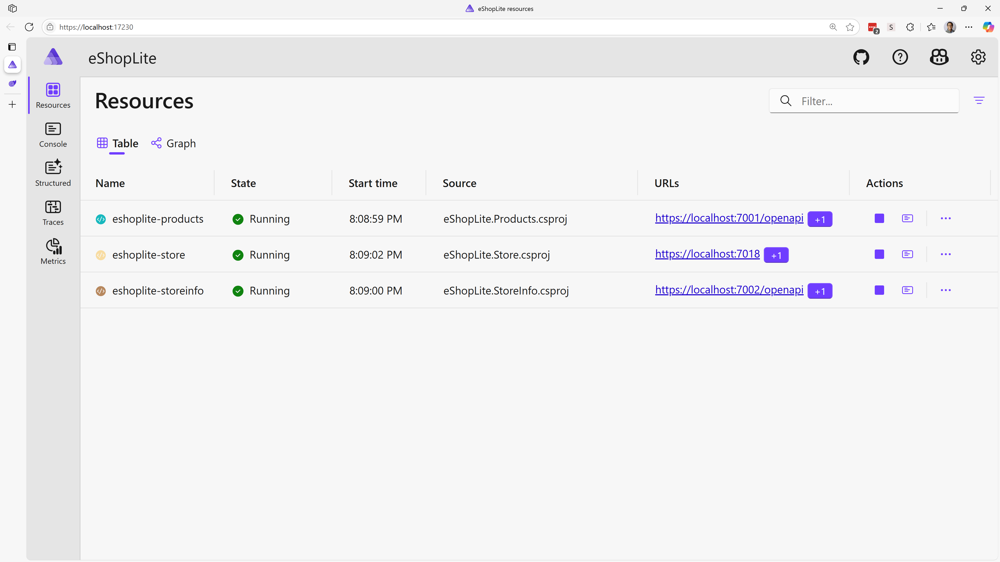

   > **NOTE**: You may be asked to enter an authentication token to access to the dashboard.
   >
   > 
   >
   > The token can be found in the terminal console. Copy and paste it to the field and click "Log in".
   >
   > 

1. Click on the endpoint for the **eshoplite-store** project in the dashboard.
1. A new tab appears with the same eShopLite application. It seems to be working but still doesn't fully make use of .NET Aspire's service discovery feature yet.
1. Close the web browser to stop debugging the applications.

### Enable service discovery

Service discovery is a way for developers to use logical names instead of physical addresses (IP address and port) to refer to external services. So instead of having to know the IP address and port of both **eShopLite.Products** and **eShopLite.StoreInfo** backend apps, the **eShopLite.Store** app can refer to it by its logical name, for example `eshoplite-products` or `eshoplite-storeinfo`.

1. Open the **AppHost.cs** file from the **eShopLite.AppHost** project.
1. Update these three lines of code to enable service discovery:

    ```csharp
    // Before
    builder.AddProject<Projects.eShopLite_Store>("eshoplite-store");
    
    builder.AddProject<Projects.eShopLite_Products>("eshoplite-products");
    
    builder.AddProject<Projects.eShopLite_StoreInfo>("eshoplite-storeinfo");

    // After
    var products = builder.AddProject<Projects.eShopLite_Products>("eshoplite-products");
    
    var storeinfo = builder.AddProject<Projects.eShopLite_StoreInfo>("eshoplite-storeinfo");

    builder.AddProject<Projects.eShopLite_Store>("eshoplite-store")
           .WithReference(products)
           .WithReference(storeinfo)
           .WaitFor(products)
           .WaitFor(storeinfo);
    ```

   `.WithReference(products)` and `.WithReference(storeinfo)` gives information to the **eShopLite.Store** app where those APIs are.

   `.WaitFor(products)` and and `.WaitFor(storeinfo)` gives indication to the **eShopLite.Store** app to wait until both backend API apps are up and running.

1. Open **Program.cs** from **eShopLite.Store** and update the base URL of the `HttpClient` instances.

    ```csharp
    // Before
    builder.Services.AddHttpClient<IProductApiClient, ProductApiClient>(client =>
    {
        client.BaseAddress = new Uri(builder.Configuration.GetValue<string>("ProductsApiUrl") ?? "https://localhost:7001");
        client.Timeout = TimeSpan.FromSeconds(30);
    });

    builder.Services.AddHttpClient<IStoreInfoApiClient, StoreInfoApiClient>(client =>
    {
        client.BaseAddress = new Uri(builder.Configuration.GetValue<string>("StoreInfoApiUrl") ?? "https://localhost:7002");
        client.Timeout = TimeSpan.FromSeconds(30);
    });

    // After
    builder.Services.AddHttpClient<IProductApiClient, ProductApiClient>(client =>
    {
        client.BaseAddress = new Uri("https+http://eshoplite-products");
        client.Timeout = TimeSpan.FromSeconds(30);
    });

    builder.Services.AddHttpClient<IStoreInfoApiClient, StoreInfoApiClient>(client =>
    {
        client.BaseAddress = new Uri("https+http://eshoplite-storeinfo");
        client.Timeout = TimeSpan.FromSeconds(30);
    });
    ```

   Notice that both URL strings like `eshoplite-products` and `eshoplite-storeinfo` refer to the backend API apps declared in **AppHost.cs** from **eShopLite.AppHost**. And the protocol `https+http` is a special one used only in .NET Aspire to use the HTTPS connection first and the HTTP connection as a fallback.

1. Hit **F5** or start debugging the application.
1. The Aspire dashboard appears again.

    

   > **NOTE**: You may be asked to enter an authentication token to access to the dashboard.
   >
   > 
   >
   > The token can be found in the terminal console. Copy and paste it to the field and click "Log in".
   >
   > 

   Click the **Graph** tab to see the relationship among those three microservice apps.

    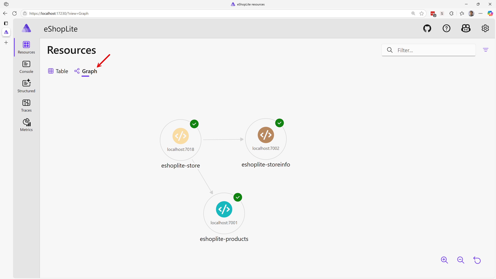

   Click back the **Table** tab and click the **View details** menu of the **eshoplite-store** app.

    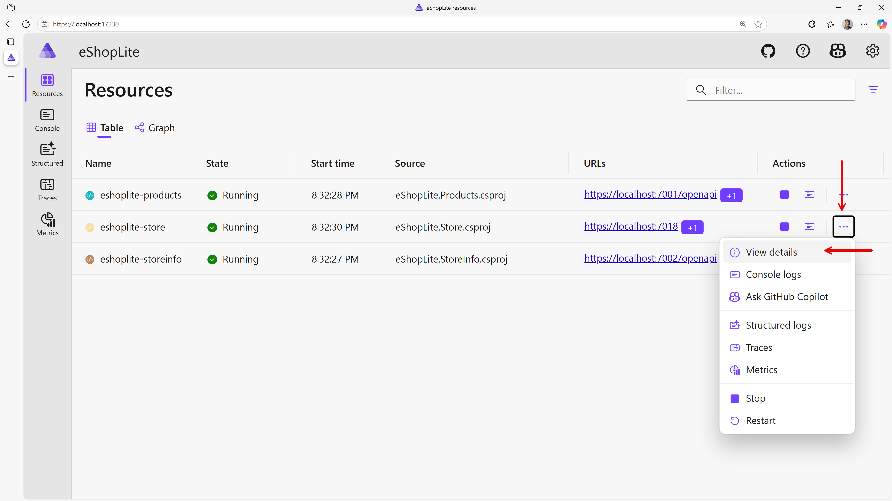

   Notice the connected apps' URL strings as a part of service discovery.

    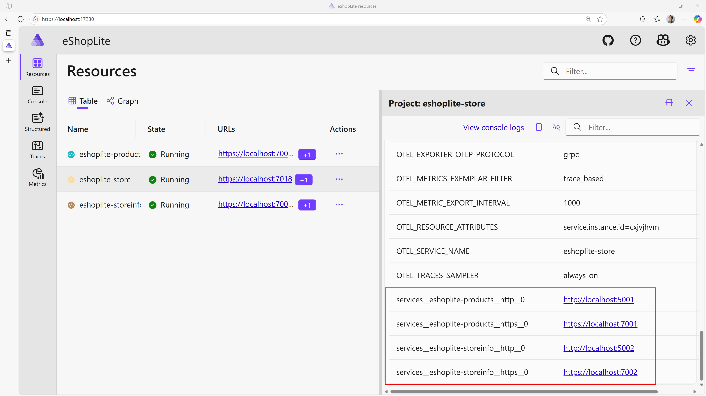

1. Click on the endpoint for the **eshoplite-store** project in the dashboard.
1. A new tab appears with the same eShopLite application and navigate to both **Products** and **Stores** through the top navigation bar. Verify both tabs are properly displaying the list of products and list of stores through .NET Aspire's service discovery feature.
1. Back to the dashboard and navigate to the **Traces** tab at the left-hand side of the screen. Then you'll find out how the data for the **Products** page has been requested.

    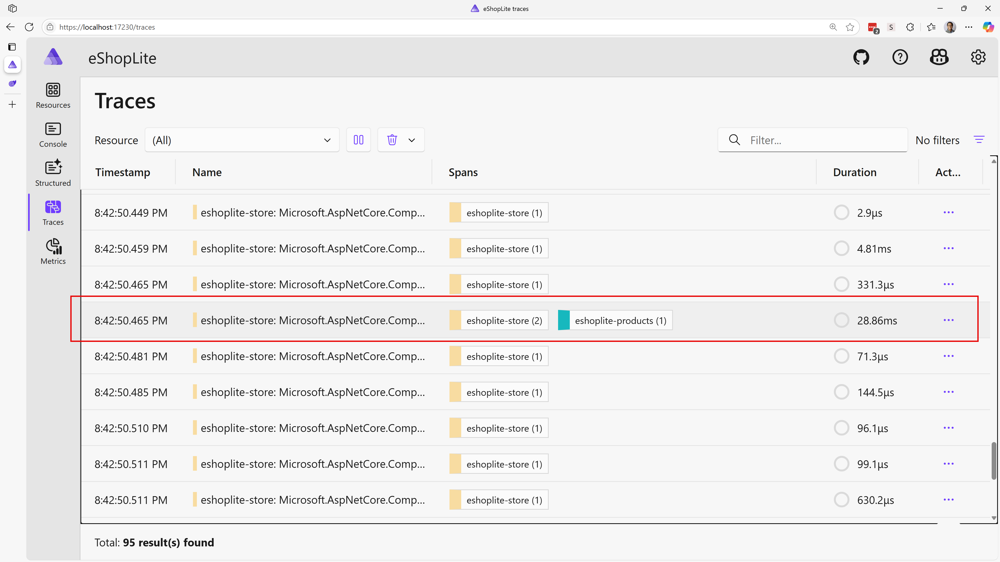

   Click the trace and see the details.

    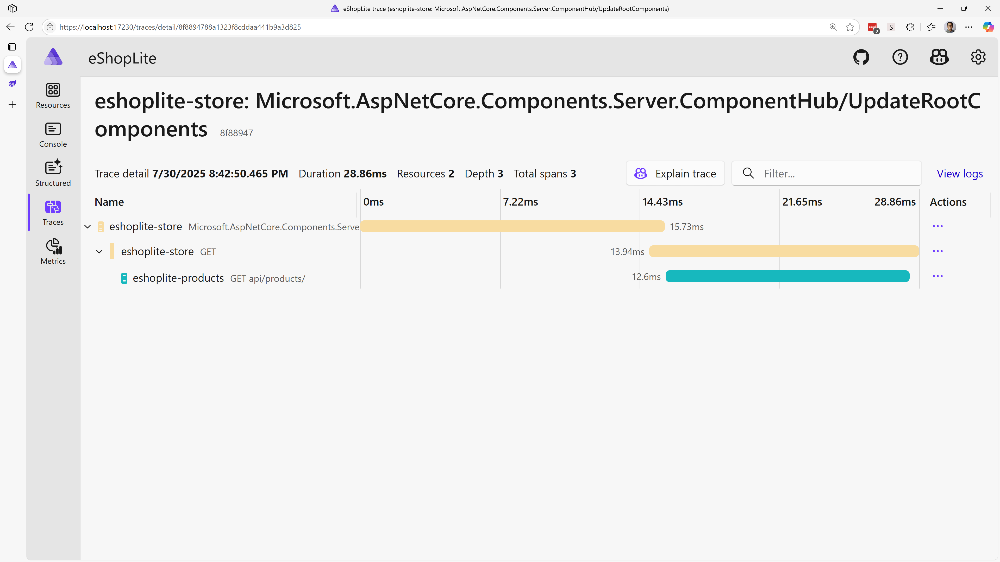

1. Close the web browser to stop debugging the applications.

All three projects are now part of the Aspire orchestration. Here's a recap of all the changes that happened, some of which were done automatically by the tooling, when adding .NET Aspire to the solution:

- An **AppHost** project is added. The project contains the orchestration code. It becomes the entry point for your app and is responsible for starting and stopping your app. It also manages the service discovery and connection string management.
- A **ServiceDefaults** project is added. The project configures OpenTelemetry, adds default health check endpoints, and enables service discovery through HttpClient.
- The solution's default startup project is changed to **AppHost**.
- Dependencies on the projects enrolled in orchestration are added to the **AppHost** project.
- The .NET Aspire Dashboard is added to your solution, which enables shortcuts to access all the project endpoints in your solution.
- The dashboard adds logs, traces, and metrics for the projects in your solution.
- All the `Program.cs` files from **eShopLite.Products**, **eShopLite.StoreInfo** and **eShopLite.Store**:
  - Add a call to `AddServiceDefaults()` that enables the default OpenTelemetry, meters, and service discovery.
  - Add a call to `MapDefaultEndpoints()` that enables the default endpoints, such as `/health` and `/alive`.
- The `Program.cs` files from **eShopLite.Store** uses the service discovery feature to communicate with backend API apps.

## ✅ Verification

By the end of this section, you should have:

🔹 Implemented service discovery with .NET Aspire  
🔹 Set up comprehensive telemetry and monitoring  
🔹 Created a unified dashboard for your microservices  

---
[← Previous: Refactor into Microservices](../4-refactor-into-microservices/README.md) | [Next: Add Redis Caching →](../6-add-redis-caching/README.md)