# 🚀 Add Redis Caching

Boost your application's performance by implementing Redis caching and integrating it seamlessly with your .NET Aspire setup.

## 📋 What You'll Do

This section covers:

⚡ Redis cache implementation  
🔧 Aspire Redis integration  
📊 Cache performance monitoring  
🎯 Caching strategies and best practices  

## 📚 Instructions

### Why add caching?

Caches can be used to improve the performance of many systems that take time to construct responses to their users. Consider, for example, an e-commerce web site, constructed from microservices. When a user wants to know what items are in their shopping basket, the system might:

1. Receive the request in the web app microservice.
1. Call the authentication microservice to check the users' identity if they're logged in.
1. Call the shopping basket microservice to find out what items and what quantities are in the basket.
1. Call the product catalog microservice to obtain full details of each product.
1. Call the images microservice to obtain image blobs for each product.
1. Call the stock taking microservice to check stock levels.
1. Call the shipping microservice to calculate shipping costs for the user's location and preferences.

The precise steps may differ depending on your design and business functionality but you can see that the process may be complex and involve many separate microservices and backing services. Although each microservice should be configured and resourced to perform well, the construction of the response inevitably consumes some time.

Now imagine that the user refreshes the page. Instead of reconstructing the entire HTML response from scratch, if the page or portions of it had been stored in a cache, it can be returned to the user much faster than the original request. This rapid response helps to make a web app more responsive and welcoming for users.

### Adding a Redis Cache

Redis is a popular choice for caching in a cloud-native application. In particular, distributed caching allows one microservice to retrieve information stored in the cache by another microservice.

We'll use .NET Aspire integrations to add Redis caching to the **eShopLite** application..NET Aspire integrations are a curated suite of NuGet packages specifically selected to facilitate the integration of cloud-native applications with prominent services and platforms such as Redis. .NET Aspire integrations handle many cloud-native concerns for you through standardized configuration patterns, such as adding health checks and telemetry.

Most .NET Aspire integrations consist of two separate libraries &ndash; one for AppHost and the other for individual applications. For Redis cache, we add the **Aspire.Hosting.Redis** package to the **eShopLite.AppHost** project and add the **Aspire.StackExchange.Redis.OutputCache** package to the **eShopLite.Store** project. Let's add them.

### Adding host integration for Redis Cache

1. Open the eShopLite solution from the **6-add-redis-caching/StartSample** folder.
1. Right click on the project **eShopLite.AppHost** and select  Add > .NET Aspire Package.

   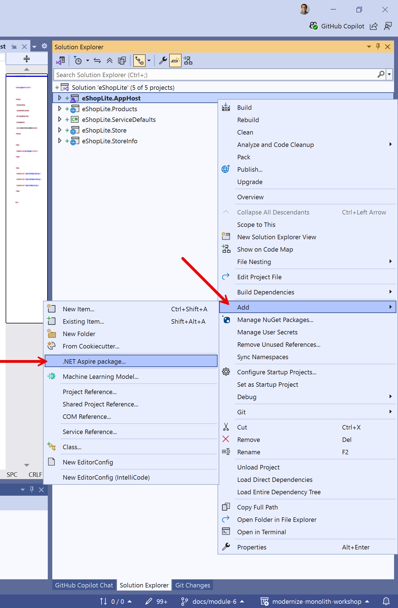

1. In the search bar, at the top left of the NuGet Package Manager, type **redis**. Select the **Aspire.Hosting.Redis** package and click the **install** button.

   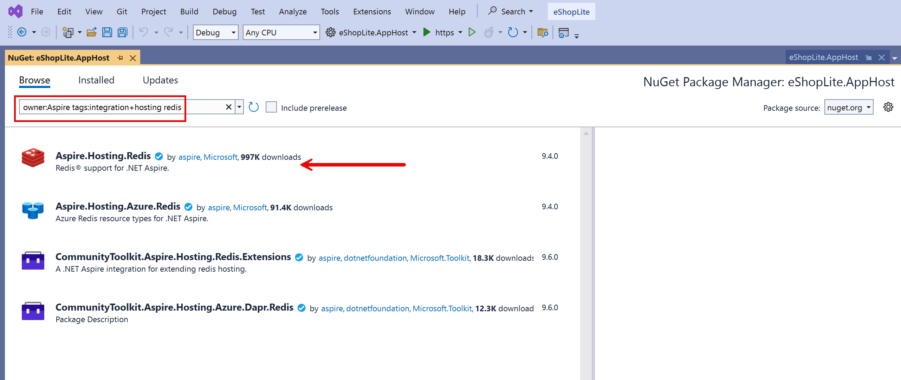

1. Click **Apply** then **I Accept** to install the NuGet package.
1. Open the **AppHost.cs** file from the **eShopLite.AppHost** project.
1. Let's create a `RedisResource` object by adding the following code just after the **builder** object is created.

    ``` csharp
    var builder = DistributedApplication.CreateBuilder(args);
    
    // 👇👇👇 Add 👇👇👇
    var redis = builder.AddRedis("redis");
    // 👆👆👆 Add 👆👆👆
    ```

1. For **eShopLite.Store** to recognize the redis cache, add another reference to the **Projects.eShopLite_Store** declaration.

    ``` csharp
    builder.AddProject<Projects.eShopLite_Store>("eshoplite-store")
           .WithReference(products)
           .WithReference(storeinfo)

           // 👇👇👇 Add 👇👇👇
           .WithReference(redis)
           // 👆👆👆 Add 👆👆👆

           .WaitFor(products)
           .WaitFor(storeinfo)

           // 👇👇👇 Add 👇👇👇
           .WaitFor(redis);
           // 👆👆👆 Add 👆👆👆
    ```

Now we have a Redis resource ready, which we can use in our application. Let's add a cache to the **eShopLite.Store** app.

### Integrating Redis Cache with **eShopLite.Store**

1. Right click on the project **eShopLite.Store** and select  Add > .NET Aspire Package.

   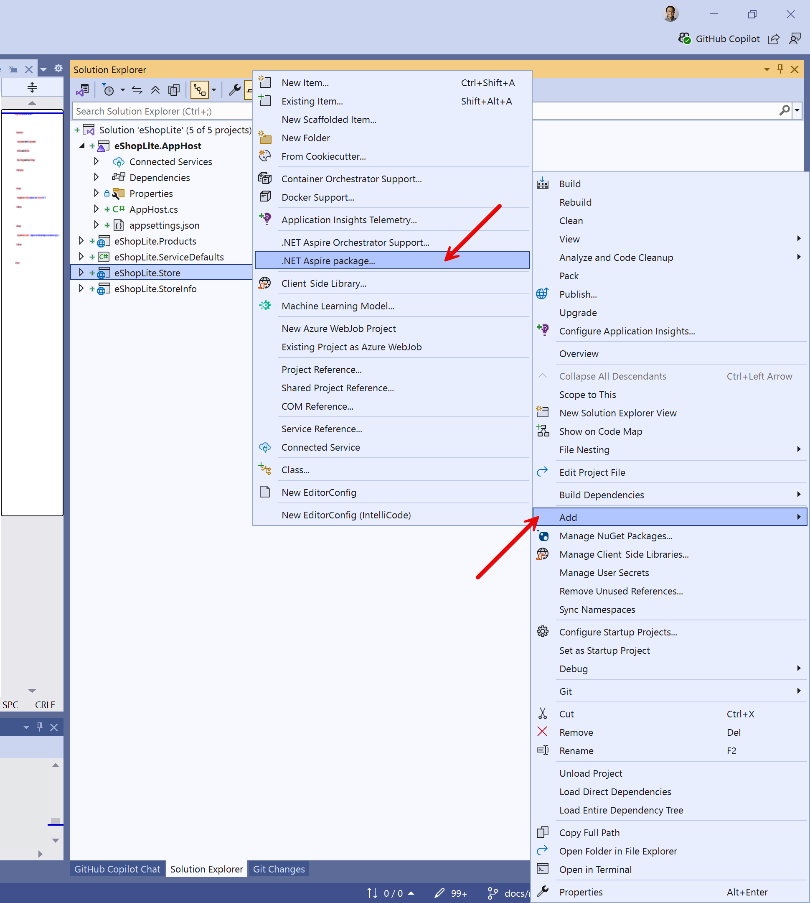

1. In the search bar, at the top left of the NuGet Package Manager, type **redis**. Select the **Aspire.StackExchange.Redis.OutputCaching** package and click the install button.

   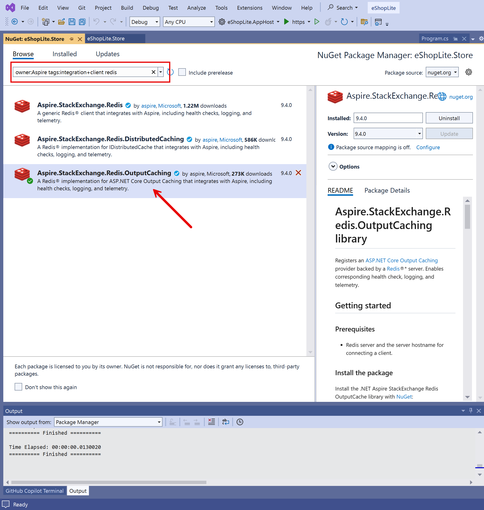

1. Click **Apply** then **I Accept** to complete the package installation.
1. Open the **Program.cs** file from the **eShopLite.Store** project.
1. Just after the `builder` is created, add the following code to add the Redis Output Cache.

    ``` csharp
    var builder = WebApplication.CreateBuilder(args);

    // 👇👇👇 Add 👇👇👇
    builder.AddRedisOutputCache("redis");
    // 👆👆👆 Add 👆👆👆
    ```

    Notice how we're referring to the redis cache as `"redis"`, the same name we gave it when we created the `RedisResource` object in the **AppHost.cs** file of the **eShopLite.AppHost** project.

1. Now to add the caching middleware to the request pipeline add the following code just after the `app` is created.

    ``` csharp
    var app = builder.Build();

    // 👇👇👇 Add 👇👇👇
    app.UseOutputCache();
    // 👆👆👆 Add 👆👆👆
    ```

1. To cache the list of products, open the **Products.razor** file from the **Components > Pages** folder. Add the following code to the top of the file, just above the `@rendermode` directive.

    ``` csharp
    @* 👇👇👇 Add 👇👇👇 *@
    @attribute [Microsoft.AspNetCore.OutputCaching.OutputCache(Duration = 10)]
    @* 👆👆👆 Add 👆👆👆 *@

    @rendermode InteractiveServer
    ```

Now, when you run the application, the products list will be cached for 10 seconds. You can change the duration to see the effect of the cache. The first time you access the page, the products list will be retrieved from the database. The next time you access the page within the cache duration, the products list will be retrieved from the cache.

We intentionally didn't apply the cache to the store information. Let's find out the differences between products list and store information on the .NET Aspire dashboard.

### Verifying the cache effect on .NET Aspire dashboard

Let's see the effect of our caching implementation in the .NET Aspire dashboard.

1. Make sure Docker Desktop is up and running before running this .NET Aspire application.
1. In Visual Studio, to start the app, press `F5` or **select Debug > Start Debugging**.
1. When the .NET Aspire dashboard appears, note the you have now four resources: **redis**, **eshoplite-products**, **eshoplite-store** and **eshoplite-storeinfo**. Unlike other resources, the source of **redis** is `docker.io/library/redis`, which is the **Container** resource type.

   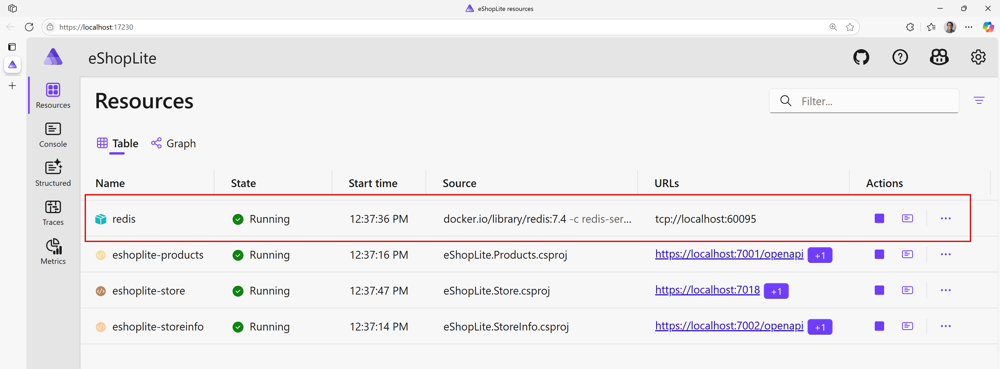

   > **NOTE**: You may be asked to enter an authentication token to access to the dashboard.
   >
   > 
   >
   > The token can be found in the terminal console. Copy and paste it to the field and click "Log in".
   >
   > 

1. Click on the **eshoplite-store** the endpoints, a new tab will open with the store website.
1. In the .NET Aspire dashboard, click on **Traces** from the left menu. This display the traces of the requests made to the store website through the different resources.

   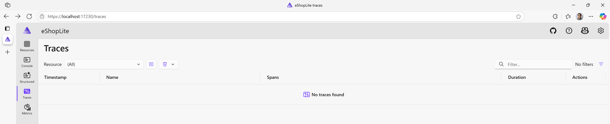

1. For the next few steps it will be easier to visualize the impact of the cache, to have the store website and the .NET Aspire dashboard side by side.
1. In the store website, click on the **Products** link. This will display the products list.
1. Note that in the .NET Aspire dashboard, new lines were added. Note that in the **Spans** column, some are identified as **eshoplite-store** only and the other are identified as both **eshoplite-store** and **eshoplite-products**. This is because the first time the products list was retrieved from the database (aka products).

   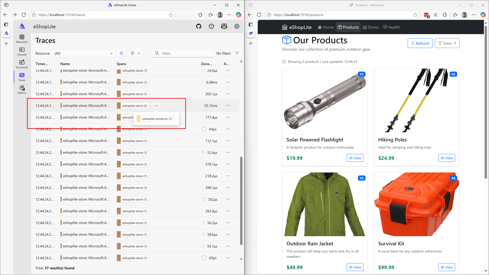

1. Click the record with two items identified and verify its whole traces from **eshoplite-store** to **eshoplite-products** that actually called API request.

   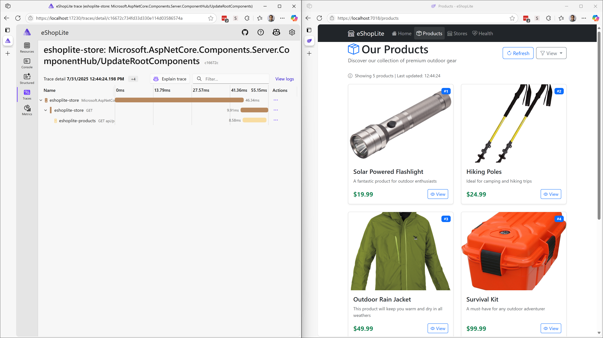

1. Now refresh the store website displaying the product list.
1. Looking back at the .NET Aspire dashboard, new lines were added, but this time in the **Spans** column, there's a new record identifying both **eshoplite-store** and **redis**. This is because the products list was retrieved from the cache.

   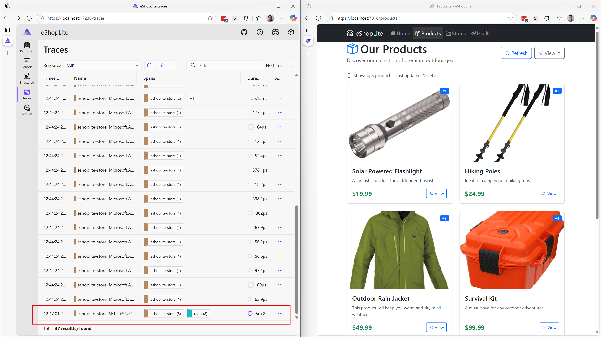

1. Click the record and verify that the response was made from cache instead of hitting the product API endpoint.

   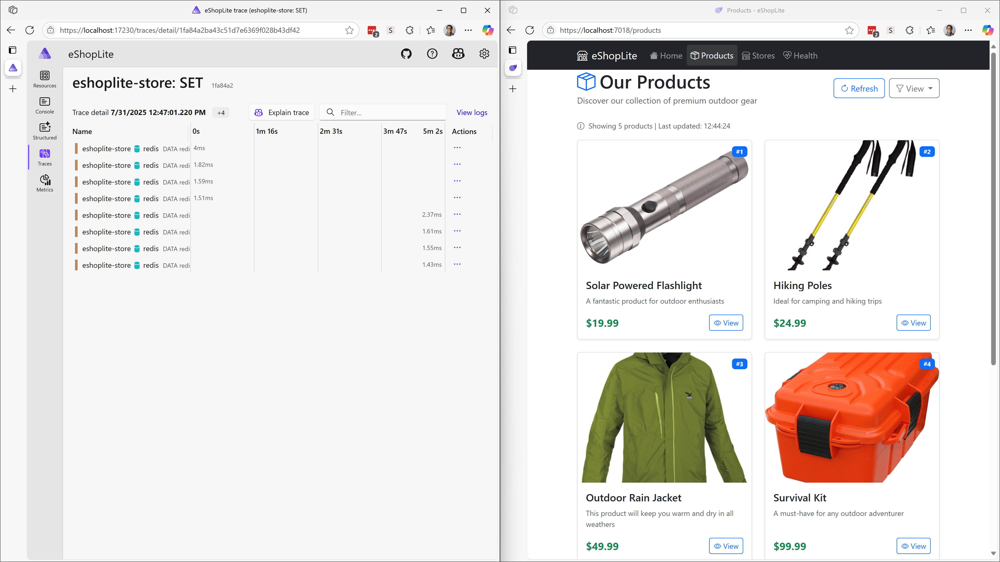

1. Try a few more time with-in or out the 10 second limit that was set in the **Products.razor** page.
1. This time, try the **Stores** link. Since we haven't integrated Redis Cache for this page, it keeps hitting the StoreInfo API endpoint to get the list of stores.

   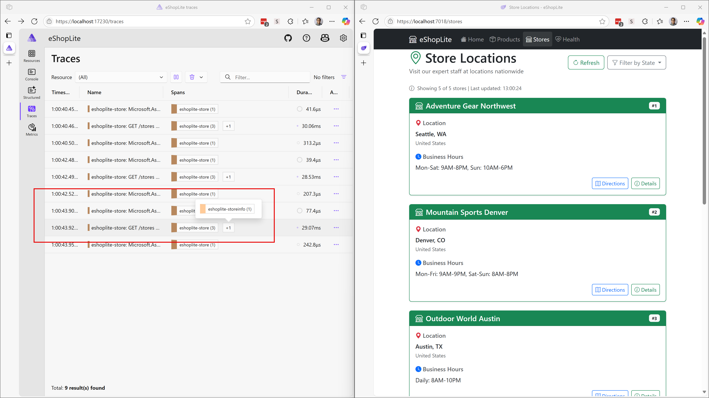

So far, we have integrated Redis Cache container through .NET Aspire orchestration. .NET Aspire doesn't only make this type of integration easier, but it also makes all other cloud-native features like observability, traceability and discoverability easier and simpler.

## ✅ Verification

By the end of this section, you should have:

🔹 Implemented Redis caching for improved performance  
🔹 Integrated caching with .NET Aspire  
🔹 Monitored cache effectiveness through telemetry  

---
[← Previous: Add .NET Aspire](../5-add-dotnet-aspire/README.md) | [Next: Deploy to ACA with azd →](../7-deploy-to-aca-with-azd/README.md)