# ☁️ Deploy to Azure Container Apps with azd

Deploy your modernized microservices to Azure Container Apps using the Azure Developer CLI (azd) for a production-ready, scalable cloud deployment.

## 📋 What You'll Do

This section demonstrates:

🚀 Azure Developer CLI (azd) usage  
📦 Container Apps deployment  
🔧 Infrastructure as Code with Bicep  
⚙️ GitHub Actions CI/CD pipeline  

## 📚 Instructions

### Replacing databases with PostgreSQL containers

Currently both **eShopLite.Products** and **eShopLite.StoreInfo** API apps use SQLite database. It's simple and easy to use but tricky when it faces to the cloud-native context due to the scalability. We need to change this database to something else.

.NET Aspire makes it very easy to add a database to your applications. Many SQL-compliant database are already available as .NET Aspire integrations. In this lab, we will replace the existing SQLite database with PostgreSQL database.

1. Open the eShopLite solution from the **7-deploy-to-aca-with-azd/StartSample** folder.
1. Right click on the project **eShopLite.AppHost** and select  **Add > .NET Aspire Package.**

   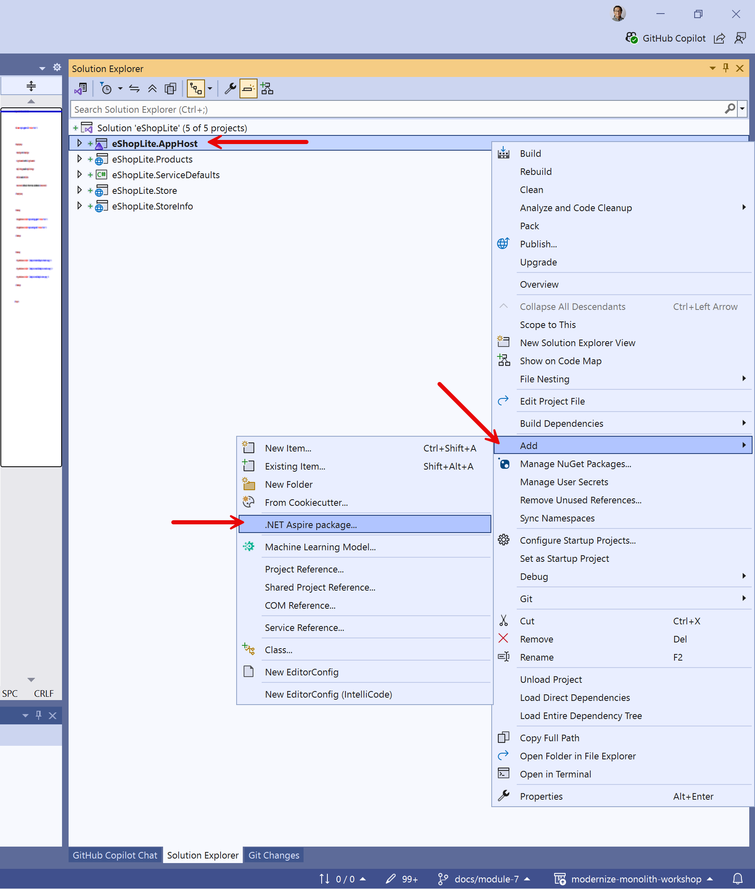

1. In the search bar, at the top left of the Nuget Package Manager, type **postgresql**. Select the  **Aspire.Hosting.PostgreSQL** package and click the install button.

   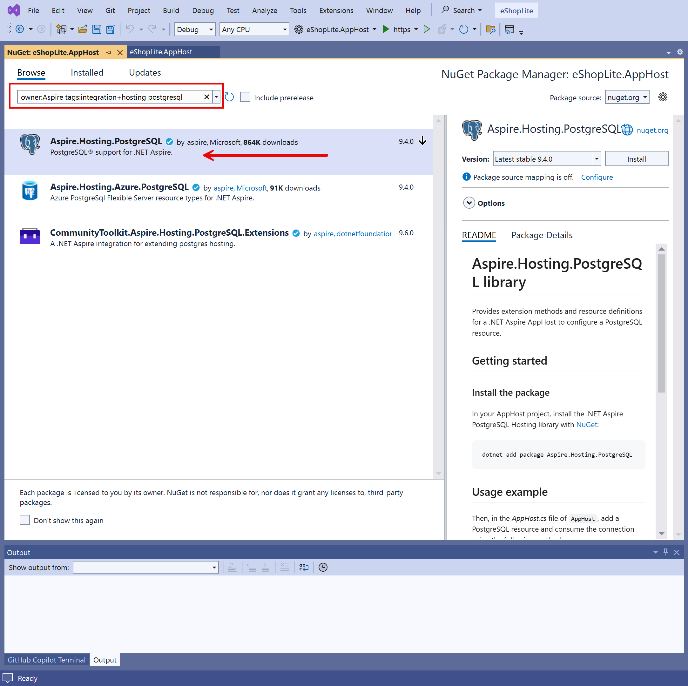

1. Open the **AppHost.cs** file from the **eShopLite.AppHost** project.
1. Right beneath the builder, let's create a database and passes it to the product API by updating the code. Here save the resource in the variable `productsdb`, and pass it to the `products` using the `WithReference` method.

    ```csharp
    var productsdb = builder.AddPostgres("pg-products")
                            .AddDatabase("productsdb");

    var products = builder.AddProject<Projects.eShopLite_Products>("eshoplite-products")
                          // 👇👇👇 Add 👇👇👇
                          .WithReference(productsdb)
                          .WaitFor(productsdb);
                          // 👆👆👆 Add 👆👆👆
    ```

   Now, create a `storeinfodb` resource instance and integrate it with the `storeinfo` resource instance, by following the same approach as above.

    ```csharp
    var storeinfodb = builder.AddPostgres("pg-storeinfo")
                             .AddDatabase("storeinfodb");

    var storeinfo = builder.AddProject<Projects.eShopLite_StoreInfo>("eshoplite-storeinfo")
                           // 👇👇👇 Add 👇👇👇
                           .WithReference(storeinfodb)
                           .WaitFor(storeinfodb);
                           // 👆👆👆 Add 👆👆👆
    ```

1. Some of the .NET Aspire database integrations also allow you to create a container for database management tools. To add **PgAdmin** to your solution to manage the PostgreSQL database, use this code:

    ``` csharp
    var productsdb = builder.AddPostgres("pg-products")
                            // 👇👇👇 Add 👇👇👇
                            .WithPgAdmin()
                            // 👆👆👆 Add 👆👆👆
                            .AddDatabase("productsdb");
    ```

   Add this PgAdmin tool to the **pg-storeinfo** database as well.

The advantage of letting .NET Aspire create the container is that you don't need to do any configuration to connect PgAdmin to the PostgreSQL database, it's all automatic. Let's configure the API apps to replace SQLite with PostgreSQL.

## Configuring API apps to use PostgreSQL databases

1. Right click on the project **eShopLite.Products** and select  **Add > .NET Aspire Package**.

   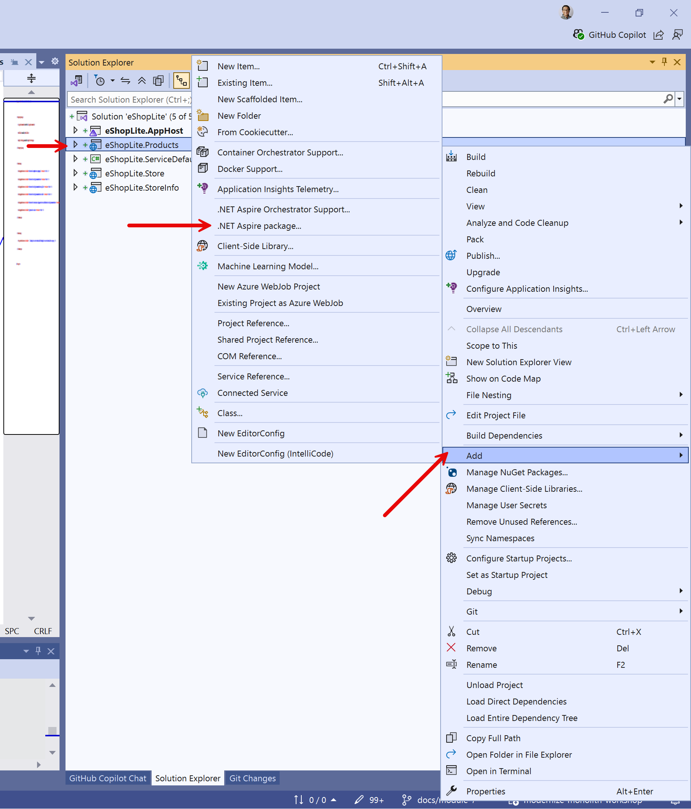

1. In the search bar, at the top left of the Nuget Package Manager, type **postgresql**. Select the **Aspire.Npgsql.EntityFrameworkCore.PostgreSQL** package and click the install button. We are using this one because the solution uses Entity Framework.

   

   > **NOTE**: There might be error occurring while installing the NuGet package due to the version mismatch. In this case, update all existing NuGet packages to the newest version and install the PostgreSQL package again.

1. Open the **Program.cs** from the **eShopLite.Products** project and update database context.

    ```csharp
    // Before
    builder.Services.AddDbContext<ProductDbContext>(options =>
    {
        var connectionString = builder.Configuration.GetConnectionString("DefaultConnection") 
            ?? "Data Source=products.db";
        options.UseSqlite(connectionString);
        
        // Enable sensitive data logging in development
        if (builder.Environment.IsDevelopment())
        {
            options.EnableSensitiveDataLogging();
            options.EnableDetailedErrors();
        }
    });

    // After
    builder.AddNpgsqlDbContext<ProductDbContext>("productsdb", configureDbContextOptions: options =>
    {
        // Enable sensitive data logging in development
        if (builder.Environment.IsDevelopment())
        {
            options.EnableSensitiveDataLogging();
            options.EnableDetailedErrors();
        }
    });
    ```

   Note that we use **productsdb** as the database connection reference, which was declared in **AppHost.cs** of the **eShopLite.AppHost** project.

   Now, add the same **Aspire.Npgsql.EntityFrameworkCore.PostgreSQL** package to the **eShopLite.StoreInfo** project and configure it as well, using the **storeinfodb** reference.

    ```csharp
    // Before
    builder.Services.AddDbContext<StoreInfoDbContext>(options =>
    {
        var connectionString = builder.Configuration.GetConnectionString("DefaultConnection") 
            ?? "Data Source=storeinfo.db";
        options.UseSqlite(connectionString);
        
        // Enable sensitive data logging in development
        if (builder.Environment.IsDevelopment())
        {
            options.EnableSensitiveDataLogging();
            options.EnableDetailedErrors();
        }
    });

    // After
    builder.AddNpgsqlDbContext<StoreInfoDbContext>("storeinfodb", configureDbContextOptions: options =>
    {
        // Enable sensitive data logging in development
        if (builder.Environment.IsDevelopment())
        {
            options.EnableSensitiveDataLogging();
            options.EnableDetailedErrors();
        }
    });
    ```

1. Remove duplicated health check endpoint from each API app, defined in `Program.cs` because .NET Aspire PostgreSQL integration automatically takes care of it.

    ```csharp
    // 👇👇👇 Remove from eShopLite.Products 👇👇👇
    // Add health checks
    builder.Services.AddHealthChecks()
        .AddDbContextCheck<ProductDbContext>();
    // 👆👆👆 Remove from eShopLite.Products 👆👆👆
    ```

    ```csharp
    // 👇👇👇 Remove from eShopLite.StoreInfo 👇👇👇
    // Add health checks
    builder.Services.AddHealthChecks()
        .AddDbContextCheck<StoreInfoDbContext>();
    // 👆👆👆 Remove from eShopLite.StoreInfo 👆👆👆
    ```

### Verifying the database changes on .NET Aspire dashboard

Let's test it:

1. Make sure Docker Desktop is up and running before running this .NET Aspire application.
1. In Visual Studio, to start the app, press `F5` or **select Debug > Start Debugging**.
1. When the .NET Aspire dashboard appears, note the you have many more resources.

   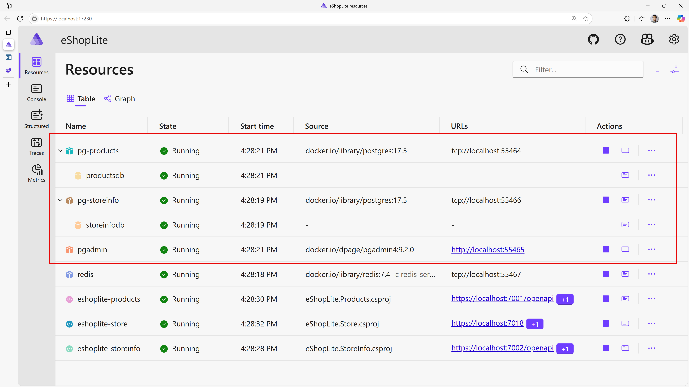

   > **NOTE**: You may be asked to enter an authentication token to access to the dashboard.
   >
   > 
   >
   > The token can be found in the terminal console. Copy and paste it to the field and click "Log in".
   >
   > 

1. Click on the **pgadmin** resource, a new tab will open with the pgAdmin website. It can takes a few seconds to completely load.
1. From the pgAdmin website, you manage both **products** and **storeinfo** databases. For example, to visualize the products table, expand the **Servers > pg-products > Databases > productsdb > Schemas > Tables**.

   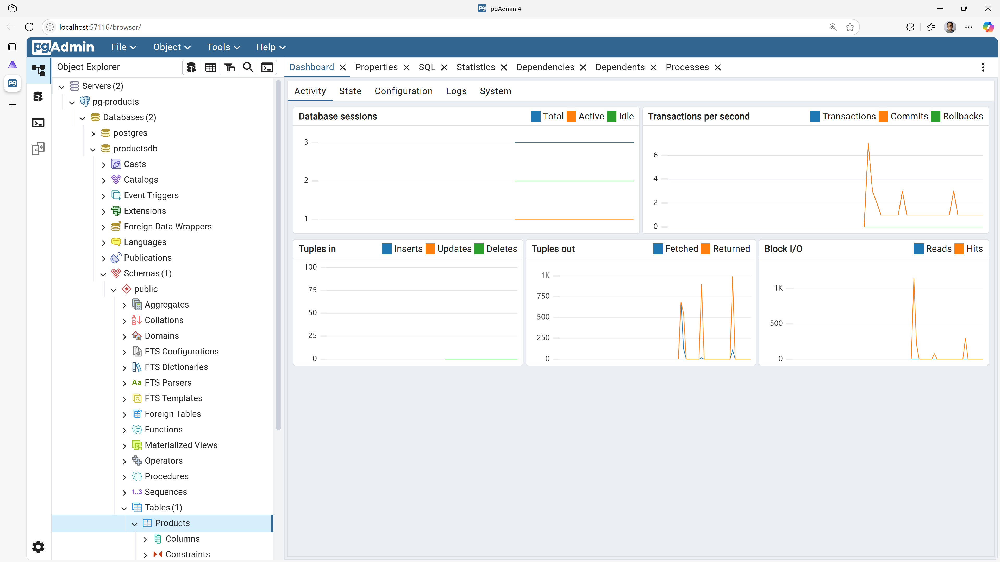

1. You can see all the rows by right-clicking on the **Products** table and selecting **View/Edit Data > All Rows**.

   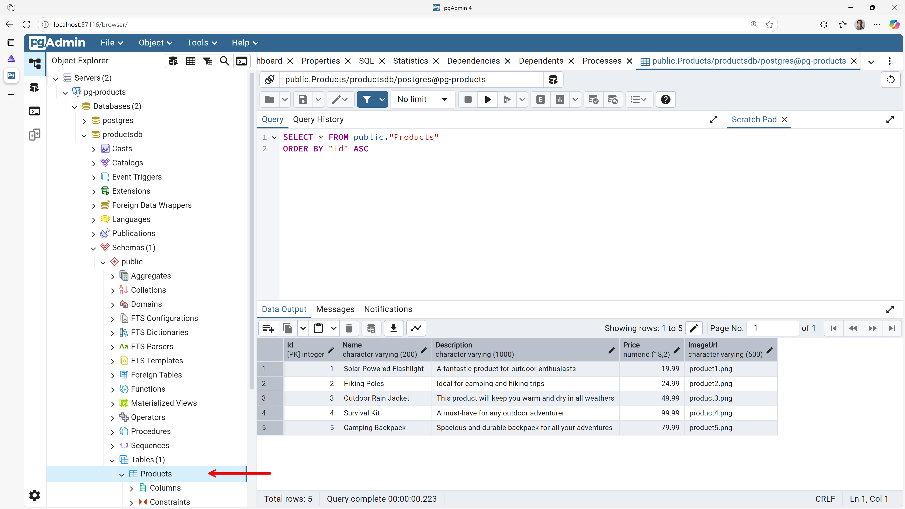

1. Now go back the the .NET Aspire dashboard, click on **eshoplite-store** the endpoints, a new tab will open with the store website.
1. The store works like before but now uses a PostgreSQL database in a container.
1. Close the web browser to stop debugging the applications.

### Deploying all apps to Azure using `azd`

`azd` is a command line interface tool that helps developers provision resources in and deploy applications to Azure. It provides best practices and developer-friendly commands that map to key stages in the development lifecycle. It provisions Azure resources via Bicep files and can deploy .NET applications to various PaaS services such as Azure Container Apps, Azure Functions, and Azure App Service.

With .NET Aspire, `azd` is particularly useful because all the apps and containers orchestrated by .NET Aspire are automatically detected and published to Azure without having to write Bicep files at all. Let's publish all the apps to Azure using `azd`.

1. Open **AppHost.cs** from the **eShopLite.AppHost** project.
1. Expose the **eShopLite.Store** app to public internet, by adding the `.WithExternalHttpEndpoints()` method. All other apps remain unexposed to keep them secure.

    ```csharp
    builder.AddProject<Projects.eShopLite_Store>("eshoplite-store")
           // 👇👇👇 Add 👇👇👇
           .WithExternalHttpEndpoints()
           // 👆👆👆 Add 👆👆👆
           .WithReference(products)
           .WithReference(storeinfo)
           .WithReference(redis)
           .WaitFor(products)
           .WaitFor(storeinfo)
           .WaitFor(redis);
    ```

1. Open Windows Terminal.
1. Navigate to the **7-deploy-to-aca-with-azd/StartSample** directory in the terminal.
1. Make sure you've already installed `azd` or updated to the latest version of it.

    ```powershell
    # Install azd
    winget install Microsoft.Azd
    ```

    ```powershell
    # Update azd
    winget update Microsoft.Azd
    ```

1. Login to Azure.

    ```powershell
    azd auth login
    ```

1. Initialize deployment environment.

    ```powershell
    azd init
    ```

   `azd` will ask several questions. Answer them as follows:

   - `? How do you want to initialize your app?`
     - `> Scan current directory`
   - `? Select an option`
     - `> Confirm and continue initializing my app`
   - `? Enter a unique environment name:`
     - `<RANDOM_NAME>`

   > **NOTE**: When you're asked to enter a unique environment name, enter any string. It'll be used to create a resource group on Azure. Use something easy to remember, saying `lab-0731`.

1. After the initialization, several files are generated in the directory.

   - `.azure/.gitignore`
   - `.azure/config.json`
   - `.azure/<RANDOM_NAME>/.env`
   - `.azure/<RANDOM_NAME>/config.json`
   - `.gitignore`
   - `next-steps.md`
   - `azure.yaml`

   Open `azure.yaml` and note what's inside.

    ```yml
    # yaml-language-server: $schema=https://raw.githubusercontent.com/Azure/azure-dev/main/schemas/v1.0/azure.yaml.json
    
    name: complete-sample
    services:  
      app:
        language: dotnet
        project: ./src/eShopLite.AppHost/eShopLite.AppHost.csproj
        host: containerapp
    ```

   It detects the **eShopLite.AppHost** project as the orchestrator and publish all the declared apps to Azure Container Apps.

1. Provision and deploy all the apps to Azure.

    ```powershell
    azd up
    ```

   `azd` will ask several questions. Answer them as follows:

   - `? Select an Azure Subscription to use:`
     - `> <AZURE_SUBSCRIPTION>`
   - `? Enter a value for the 'location' infrastructure parameter:`
     - `> <AZURE_LOCATION>`

   > **NOTE**:
   >
   > - If you have only one Azure subscription, it will be automatically chosen.
   > - Replace `<AZURE_SUBSCRIPTION>` and `<AZURE_LOCATION>` with yours.

1. `azd` will provision all the relevant resources to Azure and deploy all the apps to Azure Container Apps, and it may take several minutes.
1. Once the deployment is over, go to the Azure Portal and navigate to the resource group of `rg-<RANDOM_NAME>` and find six Azure Container Apps instances.

   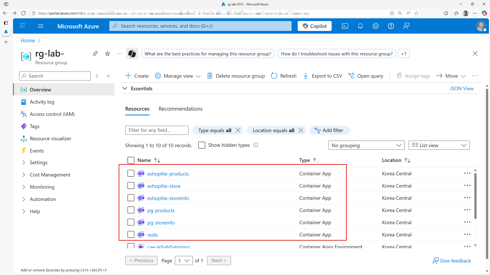

1. Click the Container Apps instance, **redis**, and notice that the **Application Url** value has the word **internal** in it. This indicates the resource is NOT exposed to the Internet.

   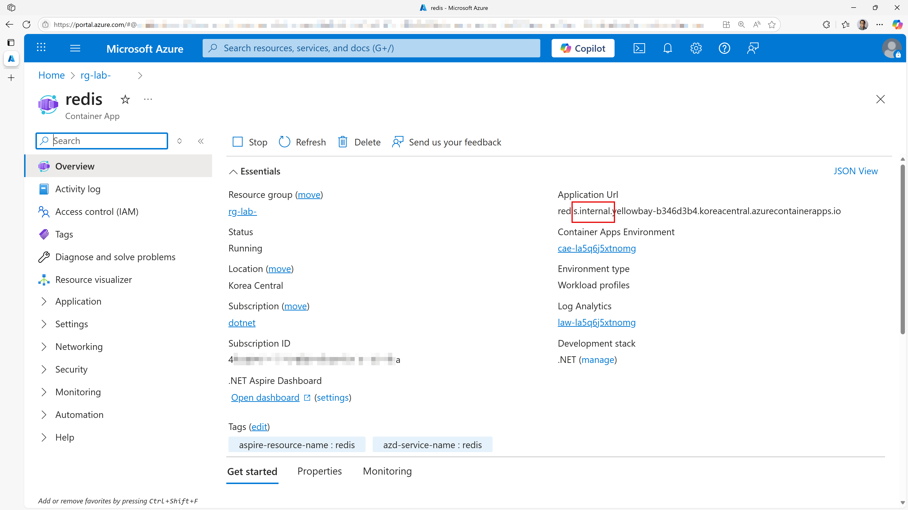

1. Click the Container Apps instance, **pg-products**, again notice the word **internal** in the **Application Url** value.

   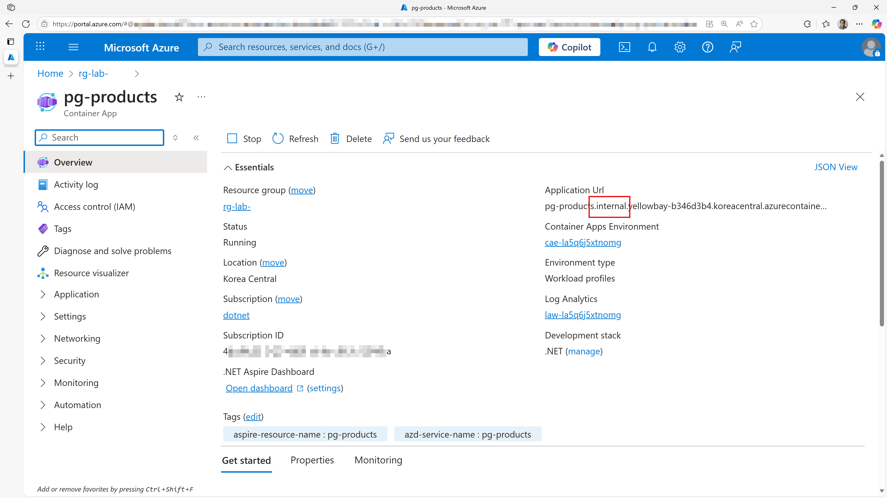

   Check out the other Container Apps instance, **pg-storeinfo** and find the **internal** in the **Application Url** string.

1. Click the Container Apps instance, **eshoplite-products**, again notice the word **internal** in the **Application Url** value.

   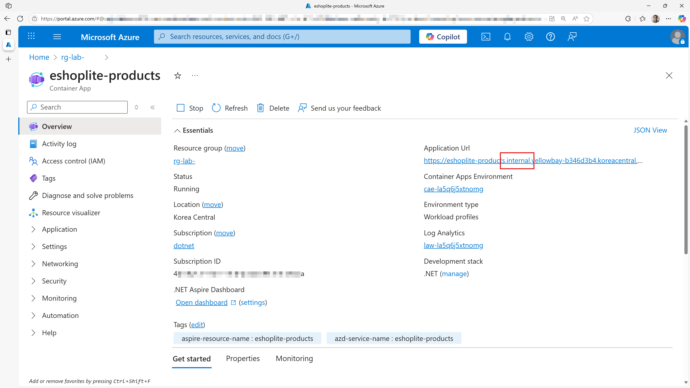

   When you actually navigate to the **eshoplite-products** API app, it will give you the 404 error.

   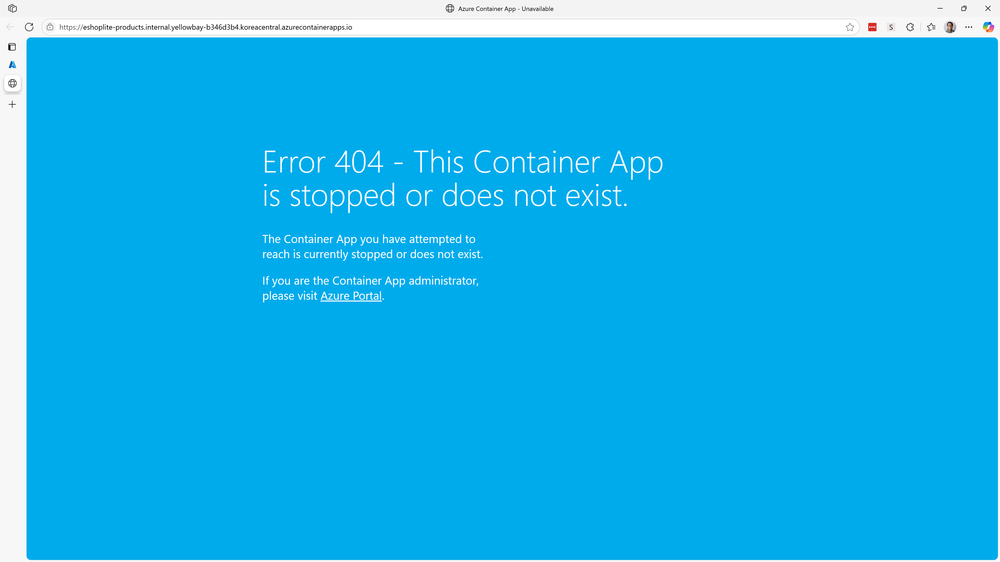

   Check out the other Container Apps instance, **eshoplite-storeinfo** and find the same result as **eshoplite-products**.

1. Click the Container Apps instance, **eshoplite-store**, and note that **Application Url** does NOT contain the word **internal**. The store website is available to the Internet.

   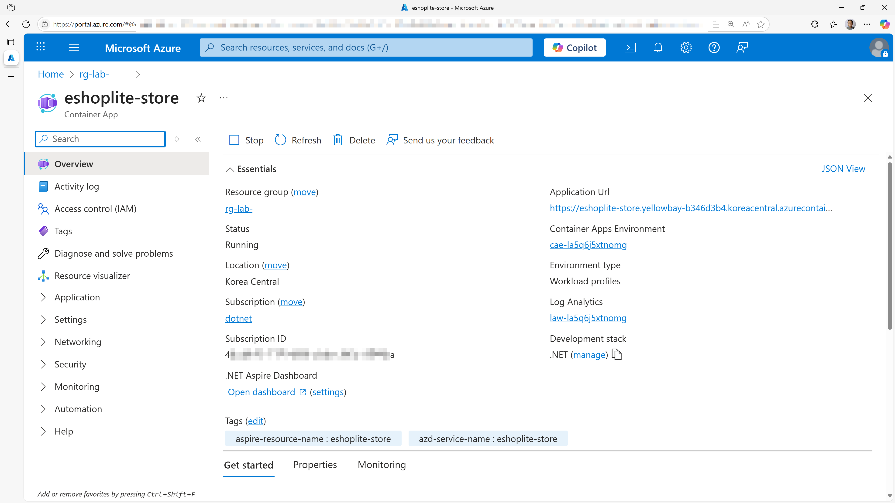

1. Navigate to the **eshoplite-store** app, navigate to both **Products** and **Stores** pages and verify the web app is up and running.

So far, we've provisioned and deployed all the apps orchestrated by .NET Aspire. But how did this happen behind the scene?

### Analysis of `azd` provisioning

That might have seemed like magic, but we can have `azd` explain what it did by creating Bicep files for the resources it provisioned. This way we could put those infrastructure files in source control.

1. Switch back to the terminal.
1. Generate the Bicep files by running the following commands:

    ```powershell
    azd infra gen
    ```

1. Confirm the following files have been generated:

   - `infra/main.bicep`
   - `infra/main.parameters.json`
   - `infra/resources.bicep`

1. Open those files and see which resources are being provisioned.

### Analysis of `azd` deployment

`azd` automatically detects the applications for you with .NET Aspire-based projects. You can still see what `azd` is deploying by generating a manifest file.

1. From the terminal run:

    ```powershell
    dotnet run --project ./src/eShopLite.AppHost `
        -- `
        --publisher manifest `
        --output-path ../../aspire-manifest.json
    ```

1. Confirm the following file has been generated:

   - `aspire-manifest.json`
   - `src/eShopLite.AppHost/infra/eshoplite-products.tmpl.yaml`
   - `src/eShopLite.AppHost/infra/eshoplite-store.tmpl.yaml`
   - `src/eShopLite.AppHost/infra/eshoplite-storeinfo.tmpl.yaml`
   - `src/eShopLite.AppHost/infra/pg-products.tmpl.yaml`
   - `src/eShopLite.AppHost/infra/pg-storeinfo.tmpl.yaml`
   - `src/eShopLite.AppHost/infra/redis.tmpl.yaml`

1. Open those files and see how those resources are being deployed.

### Cleaning up resources

1. To delete all the resources created by the deployment, you can execute the following command:

    ```powershell
    azd down --force --purge
    ```

## ✅ Verification

By the end of this section, you should have:

🔹 Deployed application to Azure Container Apps  
🔹 Set up automated CI/CD with GitHub Actions  
🔹 Implemented Infrastructure as Code with Bicep  

---
[← Previous: Add Redis Caching](../6-add-redis-caching/README.md) | [Next: Add AI Capabilities →](../8-add-ai-capabilities/README.md)