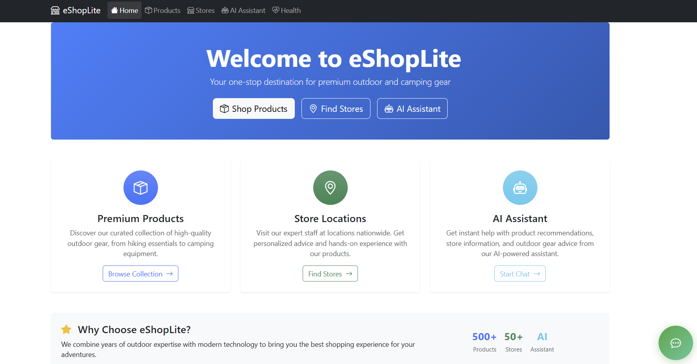
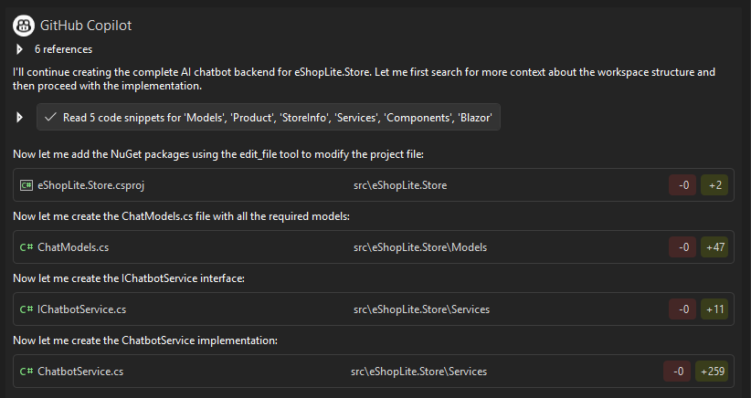
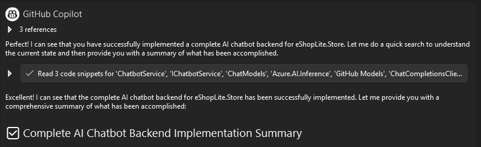
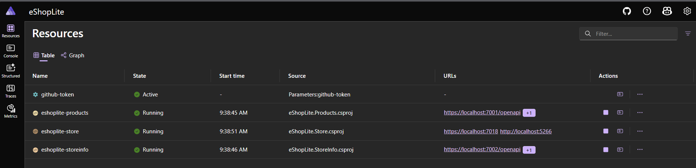
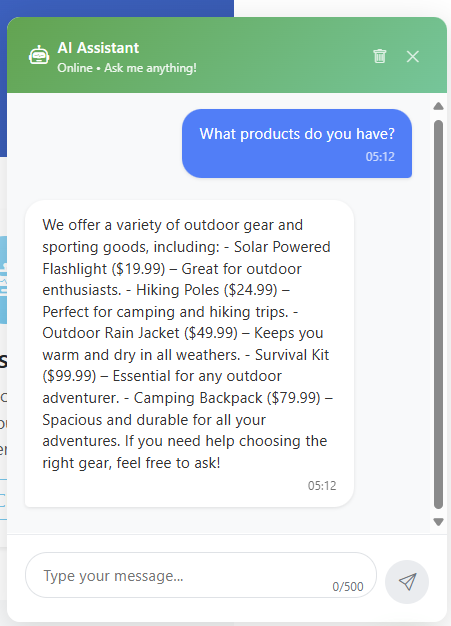

# 🧠 Add AI Capabilities

Enhance your application with intelligent features using GitHub Models, bringing cutting-edge artificial intelligence to your modernized eShopLite solution.



Transform your eShopLite store into an intelligent shopping experience with an AI-powered chatbot that understands your product catalog and provides personalized assistance to customers.

## 📋 What You'll Do

This section explores:

🤖 GitHub Models integration with Azure.AI.Inference  
💬 AI-powered chatbot implementation  
🛍️ Product-aware conversation capabilities  
🔗 Connecting AI services to your microservices architecture  
📱 Modern floating chat UI with Blazor components  
🔒 Secure token management with .NET Aspire  
🛡️ Fallback systems for AI service availability  

## 🚀 Understanding AI Integration Architecture

 Our AI chatbot implementation follows a robust architecture four our eShopLite application:
- **GitHub Models**: Leveraging LLMs for intelligent responses, to prototype with AI capabilities!
- **Azure.AI.Inference**: Modern SDK for AI service integration
- **Product Catalog Integration**: Context-aware responses about store inventory
- **Session Management**: Maintaining conversation history and context

### Technical Stack
- **Backend**: C# with Azure.AI.Inference SDK
- **Frontend**: Blazor Server components with interactive rendering
- **Configuration**: .NET Aspire parameter management

## 🛠️ Implementation Guide

We'll use GitHub Copilot with optimized prompts to streamline the AI chatbot implementation. This approach leverages agent mode to create comprehensive solutions with minimal manual intervention.

### Step 1: Complete Backend Setup

Use this comprehensive prompt to create the entire AI chatbot backend infrastructure:



Use this prompt to create the backend components:
```
Create a complete AI chatbot backend for eShopLite.Store with these components:

1. Add NuGet packages:
   - Azure.AI.Inference --prerelease
   - Microsoft.Extensions.AI

2. Create Models/ChatModels.cs with:
   - ChatMessage (Id, Content, IsUser, Timestamp)
   - ChatRequest (Message, SessionId)
   - ChatResponse (Message, SessionId, IsSuccessful, ErrorMessage)
   - ChatSession (Id, Messages, CreatedAt, LastActivity)

3. Create Services/IChatbotService.cs and Services/ChatbotService.cs:
   - GitHub Models integration using endpoint: https://models.github.ai/inference
   - Model: gpt-4o-mini, Temperature: 0.7, MaxTokens: 500
   - Inject IProductApiClient for product awareness
   - Session management with ConcurrentDictionary
   - Conversation history (last 10 messages)
   - Fallback responses when AI unavailable using pattern matching
   - Methods: SendMessageAsync, GetChatHistoryAsync, ClearChatHistoryAsync

4. Update Program.cs:
   - Register ChatCompletionsClient as singleton with GitHub token from environment
   - Register IChatbotService as scoped
   - Handle missing token gracefully with fallback mode

Don't create any extra frontend before asked, focus on the backend part

Use this sample as template for connection: 
/*
Run this model in C#.

> dotnet add package Azure.AI.Inference --prerelease
*/
using Azure;
using Azure.AI.Inference;

// To authenticate with the model you will need to generate a personal access token (PAT) in your GitHub settings. 
// Create your PAT token by following instructions here: https://docs.github.com/en/authentication/keeping-your-account-and-data-secure/managing-your-personal-access-tokens
var credential = new AzureKeyCredential(System.Environment.GetEnvironmentVariable("GITHUB_TOKEN"));

var client = new ChatCompletionsClient(
    new Uri("https://models.github.ai/inference"),
    credential,
    new AzureAIInferenceClientOptions()););

var requestOptions = new ChatCompletionsOptions()
{
    Messages =
    {
        new ChatRequestSystemMessage(""),
        new ChatRequestUserMessage("Can you explain the basics of machine learning?"),
    },
    Model = "openai/o3-mini",
    Temperature = {temperature},
    MaxTokens = {max_tokens},

};

Response<ChatCompletions> response = client.Complete(requestOptions);
System.Console.WriteLine(response.Value.Content);
```

This single prompt will generate all the necessary backend components including data models, service interfaces, implementation with AI integration, session management, and dependency injection configuration.



>**Note**: It is possible that the AI will create some UI components to test the backend. You can ignore these for now, as we will focus on the backend implementation first. 

>**Note**: The versions of the packages used in the prompt may not be the latest. You can update them to the latest versions as needed.

### Step 2: Complete Frontend and Aspire Implementation

Use this prompt to create the modern chat interface:


**Prompt for Frontend Implementation:**

```
Create a complete chat UI for eShopLite.Store:

1. Create Components/Shared/ChatWidget.razor with:
   - Floating green button (80px) in bottom-right with chat icon
   - Expandable chat window (400x550px) above button
   - Direct @inject IChatbotService (not HttpClient)
   - @rendermode="InteractiveServer"
   - Message bubbles (user right/blue, bot left/gray)
   - Input field with 500 char limit and send button
   - Typing indicator during processing
   - Clear chat button in header
   - All styles inline to avoid CSS scoping issues
   - Z-index: 9999 for proper overlay
   - Mobile responsive design

2. Update MainLayout.razor:
   - Add <ChatWidget @rendermode="InteractiveServer"/> at bottom
   - Ensure proper component placement

3. Update _Imports.razor:
   - Add @using eShopLite.Store.Components.Shared

Configure .NET Aspire integration
4. Update AppHost Program.cs:
   - Add parameter: builder.AddParameter("github-token", secret: true)
   - Pass to Store: .WithEnvironment("GITHUB_TOKEN", githubToken)
   - Configure service dependencies
```

This prompt creates a production-ready chat widget with modern UI/UX, responsive design, and seamless integration with your Blazor application.


### Step 3: Configure .NET Aspire Integration

Run our application, to start to use the AI chatbot, we need to configure .NET Aspire for secure token management and service dependencies.

Follow these steps:

1. Run the application to generate the initial configuration files:
   ```bash
   dotnet run --project eShopLite.AppHost
   ```
   or press F5 in Visual Studio.

2. While the application is running, notice the message above about missing parameters. This indicates that we need to set up our GitHub token for AI service access.


3. Click on the parameter on the .NET Aspire dashboard to add your GitHub token. If you don't have a token yet, follow the instructions to create one in your GitHub account settings [here](https://docs.github.com/en/authentication/keeping-your-account-and-data-secure/managing-your-personal-access-tokens#creating-a-personal-access-token-classic).

4. Add your GitHub token in the .NET Aspire dashboard in a popup window, that looks like this:


5. Done, the configuration is now complete, and your application can securely access GitHub Models for AI capabilities. Your dashboard should now show the parameter as configured:



## ✅ Verification

Test your AI chatbot implementation:

1. **Start the Application**
   ```bash
   dotnet run --project eShopLite.AppHost
   ``` 
   or press F5 in Visual Studio.

2. **In the Aspire dashboard**, ensure the GitHub token is set correctly. Click the URL to open the Store application in your browser.

3. **Test Chat Functionality**
   - Click the green chat button in the bottom-right corner
   - Try various queries:
     - "What products do you have?"
     - "Tell me about hiking gear"
     - "What's the price of the flashlight?"
     - "Hello!"



Your AI-enhanced eShopLite store should now feature:

✅ **Intelligent Chat Assistant**: AI-powered responses using GitHub Models  
✅ **Product Awareness**: Context-aware recommendations from your catalog  
✅ **Modern UI**: Responsive, floating chat interface  
✅ **Robust Architecture**: Fallback systems and error handling  
✅ **Secure Configuration**: Token management through .NET Aspire  
✅ **Production Ready**: Scalable session management and performance optimization  

## 🎯 What You've Accomplished

Your modernized application now represents a complete transformation from a legacy .NET Framework monolith to a cutting-edge, AI-enhanced microservices solution ready for deployment!

---
[← Previous: Deploy to ACA with azd](../7-deploy-to-aca-with-azd/README.md) | [🎉 Workshop Complete! Back to Main →](../README.md)