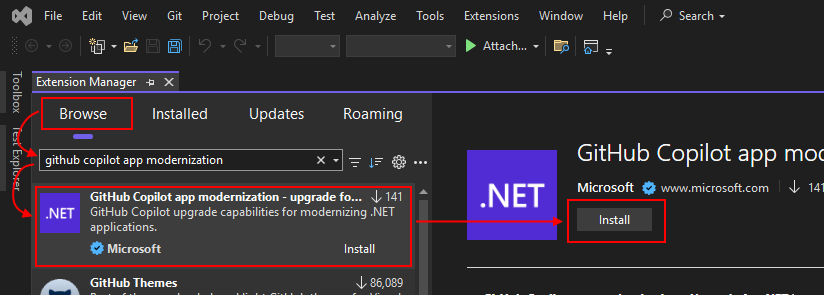
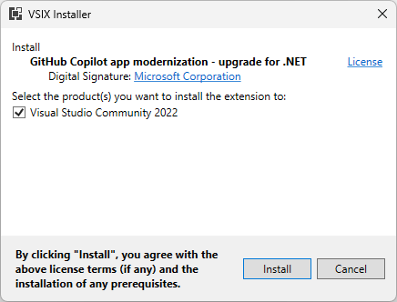

# 🔧 1. Configurando o Ambiente

Este workshop foi desenvolvido para ajudá-lo a modernizar aplicações .NET, desde a migração do .NET Framework para o .NET moderno, preparando o código para a nuvem e até adicionando capacidades de IA.

Mas antes de mergulharmos em tudo isso, precisamos instalar algumas ferramentas essenciais.


## 📝 Ferramentas e Frameworks

Para este workshop, você precisará de algumas ferramentas e frameworks que talvez já tenha instalados.

O workshop está dividido em 2 partes:

- **Parte 1**: Modernizando código do .NET Framework para o .NET moderno
- **Parte 2**: Preparando para a nuvem e adicionando IA

Forneceremos soluções iniciais para cada parte - então, se você quiser pular direto para a Parte 2, pode ignorar a instalação de tudo relacionado à Parte 1.

## 🎯 Requisitos Gerais

Estas ferramentas são necessárias para todo o workshop:

### Essenciais

- **[.NET 9 SDK](https://dotnet.microsoft.com/pt-br/download/dotnet/9.0)**: A versão mais recente do SDK .NET que você precisará para desenvolvimento.
- **[Visual Studio 2022](https://visualstudio.microsoft.com/pt-br/vs/)**: IDE com a carga de trabalho web instalada. Versão Community é suficiente.

### Verificando a Instalação do .NET 9

Após instalar o .NET 9 SDK, abra um terminal e execute:

```bash
dotnet --version
```

Você deve ver algo como `9.0.xxx` ou superior.

```bash
dotnet --list-sdks
```

Isso deve listar o .NET 9 entre os SDKs instalados.

## 🔧 Requisitos para Parte 1 - Modernizando Código

Se você planeja começar do início, desde a migração do .NET Framework, precisará destas ferramentas adicionais:

### Ferramentas de Upgrade

- **[.NET Framework 4.8](https://dotnet.microsoft.com/pt-br/download/dotnet-framework/net48)**: A versão do .NET Framework que a aplicação de exemplo utiliza atualmente.
- **[.NET Upgrade Assistant](https://learn.microsoft.com/pt-br/dotnet/core/porting/upgrade-assistant-overview)**: Ferramenta para auxiliar no upgrade de aplicações .NET.
- **[GitHub Copilot App Modernization](https://learn.microsoft.com/pt-br/dotnet/core/porting/github-copilot-app-modernization-install#visual-studio-extension)**: Extensão do Copilot que auxiliará no processo de migração com sugestões e automação de tarefas.

### Banco de Dados

- **[SQL Server Express](https://www.microsoft.com/pt-br/download/details.aspx?id=104781)**: Versão leve do SQL Server para desenvolvimento e testes locais.

### Assinatura GitHub

- **[GitHub Copilot Pro](https://github.com/features/copilot)**: Opcional para a seção de upgrade com GitHub Copilot, mas altamente recomendado para aproveitar ao máximo o workshop.

## 🚀 Requisitos para Parte 2 - Modernizando para Nuvem e IA

Se você está começando da Parte 2 ou continuando da Parte 1:

- **[Docker Desktop](https://docs.docker.com/desktop/)**: Para containerização e execução local de containers.
- **[Azure CLI](https://learn.microsoft.com/pt-br/cli/azure/install-azure-cli)**: Interface de linha de comando para Azure (opcional para este workshop).
- **[Azure Developer CLI (azd)](https://learn.microsoft.com/pt-br/azure/developer/azure-developer-cli/install-azd)**: Ferramenta para simplificar o deploy em Azure (opcional para este workshop).
- **[Assinatura Azure](https://azure.microsoft.com/pt-br/free/)**: Opcional para este workshop, mas útil se você quiser fazer deploy na nuvem.

## 📚 Instalando os Assistentes de Upgrade

Vamos detalhar a instalação dos assistentes de upgrade. As instruções são as mesmas tanto para o **.NET Upgrade Assistant** quanto para o **GitHub Copilot App Modernization** - você só precisa alterar o que procura.

### Passo a Passo

#### 1. Abra o Visual Studio

Inicie o Visual Studio 2022.

#### 2. Acesse o Gerenciador de Extensões

Vá no menu superior e selecione **Extensões > Gerenciar Extensões** (ou **Extensions > Manage Extensions** em inglês).

#### 3. Busque a Extensão

- Selecione a aba **Browse** (Procurar)
- Busque por `.NET Upgrade Assistant` ou `GitHub Copilot App Modernization`

#### 4. Instale a Extensão

Clique no botão **Install** (Instalar) para instalar a extensão.



#### 5. Feche o Visual Studio

Após o download da extensão, feche o Visual Studio para iniciar automaticamente a instalação.

#### 6. Confirme a Instalação

Uma janela aparecerá solicitando a instalação da extensão. Clique em **Install** (Instalar).



### ✅ Validação da Instalação

Após a instalação, valide que tudo está funcionando:

#### Método 1: Verificar Extensões Instaladas

1. Abra o Visual Studio
2. Vá em **Extensões > Gerenciar Extensões > Instalado** (Extensions > Manage Extensions > Installed)
3. Você deve ver o nome da extensão na lista

#### Método 2: Verificar Menu de Contexto

1. Abra qualquer projeto .NET ou .NET Framework no Visual Studio
2. Clique com o botão direito no projeto no **Solution Explorer**
3. Você deve ver um item de menu **Upgrade** (Atualizar)

## 🤖 Configurando o GitHub Copilot

Para aproveitar ao máximo este workshop, certifique-se de que o GitHub Copilot está configurado:

### Verificar Assinatura

1. Acesse [github.com/settings/copilot](https://github.com/settings/copilot)
2. Verifique se você tem uma assinatura ativa do Copilot Pro
3. Se não tiver, considere iniciar um trial gratuito

### Ativar no Visual Studio

1. Abra o Visual Studio 2022
2. Vá em **View > GitHub Copilot Chat** (ou use o atalho `Ctrl+/`)
3. Faça login com sua conta GitHub quando solicitado
4. O painel do GitHub Copilot deve aparecer

### Testar o Copilot

Para verificar se está funcionando:

1. Abra qualquer arquivo C#
2. Comece a digitar um comentário como `// function to calculate sum of two numbers`
3. O Copilot deve sugerir uma implementação
4. Pressione `Tab` para aceitar a sugestão

## 📦 Clonando o Repositório do Workshop

Agora vamos obter o código de exemplo para o workshop:

### Opção 1: Via Git (Recomendado)

```bash
git clone https://github.com/PabloNunes/modernize-monolith.git
cd modernize-monolith
```

### Opção 2: Download Direto

1. Acesse [github.com/PabloNunes/modernize-monolith](https://github.com/PabloNunes/modernize-monolith)
2. Clique no botão **Code** > **Download ZIP**
3. Extraia o arquivo ZIP em uma pasta de sua preferência

## 🧪 Verificação Final

Antes de prosseguir, vamos fazer uma verificação completa:

### Checklist de Pré-requisitos

Marque cada item conforme completa:

- [ ] .NET 9 SDK instalado e verificado (`dotnet --version`)
- [ ] Visual Studio 2022 instalado com carga de trabalho web
- [ ] .NET Upgrade Assistant OU GitHub Copilot App Modernization instalado
- [ ] GitHub Copilot configurado e funcionando no Visual Studio
- [ ] SQL Server Express instalado (para Parte 1)
- [ ] Repositório modernize-monolith clonado localmente
- [ ] Docker Desktop instalado (para Parte 2 - opcional)

### Teste Rápido

Execute este comando para verificar se o .NET está funcionando:

```bash
dotnet new console -n TesteWorkshop
cd TesteWorkshop
dotnet run
```

Você deve ver a mensagem "Hello, World!" no console.

Após o teste, pode deletar a pasta:

```bash
cd ..
rmdir /s TesteWorkshop  # Windows
# ou
rm -rf TesteWorkshop     # Linux/Mac
```

## 🎯 Estrutura do Projeto

O repositório que você clonou tem a seguinte estrutura:

```
modernize-monolith/
├── 1-setup-your-environment/      # Instruções de setup (em inglês)
├── 2-upgrade-dotnet/               # Módulo de upgrade
│   ├── 2-upgrade-with-dotnet-upgrade-assistant/
│   └── 2-upgrade-with-ghcp-modernization-app/
├── 3-modernize-with-github-copilot/ # Módulo de modernização
├── 8-add-ai-capabilities/          # Módulo de IA
├── translation/                    # Conteúdo em português (este workshop)
└── README.md                       # README principal (em inglês)
```

Para este workshop, seguiremos o conteúdo na pasta `translation/` (onde você está agora).

## ⚠️ Problemas Comuns

### Problema: Visual Studio não reconhece .NET 9

**Solução**: 
1. Certifique-se de ter a versão mais recente do Visual Studio 2022
2. Execute o Visual Studio Installer e atualize
3. Verifique se a carga de trabalho "Desenvolvimento web e ASP.NET" está instalada

### Problema: GitHub Copilot não aparece

**Solução**:
1. Verifique se está logado na conta GitHub correta no Visual Studio
2. Vá em **Tools > Options > GitHub > Accounts** e faça login novamente
3. Reinicie o Visual Studio

### Problema: Extensões não instalam

**Solução**:
1. Execute o Visual Studio como Administrador
2. Desabilite temporariamente o antivírus
3. Limpe o cache de extensões: Delete `%LocalAppData%\Microsoft\VisualStudio\17.0\Extensions`

### Problema: Erro ao executar dotnet --version

**Solução**:
1. Verifique se o caminho do .NET está na variável de ambiente PATH
2. Reinicie o terminal/prompt de comando
3. Em último caso, reinstale o .NET 9 SDK

## 💡 Dicas para o Workshop

**Antes de começar:**
- Feche todos os programas desnecessários para liberar recursos
- Desabilite notificações para evitar distrações
- Tenha água e café por perto ☕
- Mantenha o Visual Studio aberto durante todo o workshop

**Durante o workshop:**
- Não tenha medo de experimentar
- Se algo der errado, sempre há a opção de recomeçar
- Aproveite o GitHub Copilot - ele está aqui para ajudar!
- Faça perguntas sempre que tiver dúvidas

## 🎓 Recursos de Referência

Mantenha estes links em mãos durante o workshop:

- [Documentação .NET](https://docs.microsoft.com/pt-br/dotnet/)
- [Guia de Upgrade .NET](https://learn.microsoft.com/pt-br/dotnet/core/porting/)
- [GitHub Copilot Docs](https://docs.github.com/pt/copilot)
- [Visual Studio Docs](https://docs.microsoft.com/pt-br/visualstudio/)

## ✅ Pronto para Continuar!

Parabéns! Seu ambiente está configurado e você está pronto para começar a jornada de modernização.

Na próxima seção, vamos mergulhar no processo de upgrade da aplicação do .NET Framework para o .NET 9.

---

**⏱️ Tempo estimado desta seção**: 15-20 minutos  
**✅ Checkpoint**: Todos os pré-requisitos instalados e verificados

---

[← Voltar: Introdução](./00-introducao.md) | [Próximo: Atualização do .NET →](./02-atualizacao-dotnet.md)
