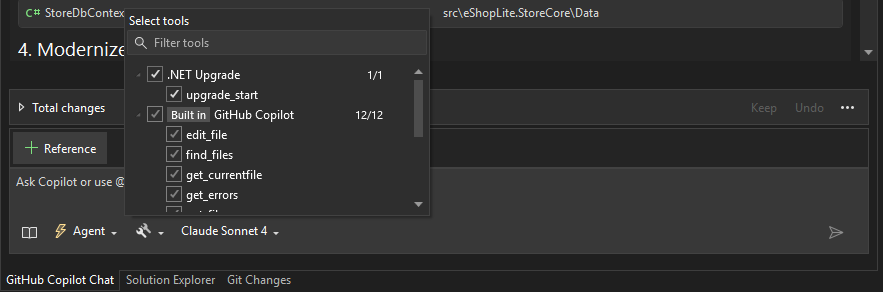
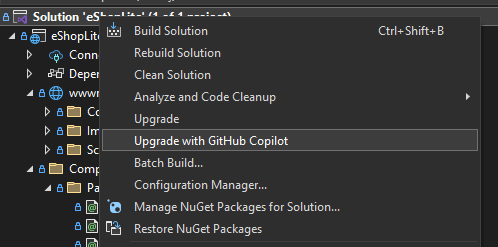

# 🔄 2. Atualização do .NET

Bem-vindo ao Capítulo 2 do workshop de modernização! Esta seção foca em atualizar sua aplicação .NET Framework para o .NET moderno usando diferentes abordagens e ferramentas potencializadas por IA.

## 📋 O que você vai aprender

Neste capítulo, você explorará duas abordagens diferentes para atualizar suas aplicações .NET:

🛠️ **Migração Tradicional**: Usando .NET Upgrade Assistant para migração estruturada, passo a passo  
🤖 **Upgrade Assistido por IA**: Aproveitando o GitHub Copilot para upgrade inteligente e automatizado  

Ambas as abordagens alcançam o mesmo objetivo - transformar sua aplicação legada do .NET Framework em uma aplicação .NET moderna - mas usam metodologias e ferramentas diferentes.

> ⚠️ **IMPORTANTE**
> 
> Se você tentar depurar a versão .NET Framework da aplicação eShopLite, pode receber um erro similar a:
> `Could not find part of the path...`
>
> Isso é esperado devido à estrutura do projeto de exemplo.

## 🚀 Escolha seu Caminho

Selecione a abordagem que melhor se adequa ao seu estilo de aprendizado e requisitos:

### Opção A: .NET Upgrade Assistant (Abordagem Tradicional)

#### Características

- ✅ Escaneia seu projeto e gera um relatório para guiar seu upgrade
- ✅ Permite escolher entre modos de upgrade: in-place, side-by-side ou incremental
- ✅ Funciona com muitos tipos de projetos como ASP.NET, Windows Forms, WPF e mais
- ✅ Controle detalhado sobre cada etapa do processo

#### Quando Usar

Esta abordagem é ideal se você:
- Prefere ter controle total sobre cada etapa do upgrade
- Quer entender profundamente as mudanças necessárias
- Tem requisitos específicos de compatibilidade
- Está migrando uma aplicação com muitas personalizações

#### Como Funciona

1. **Análise**: A ferramenta analisa seu projeto e identifica incompatibilidades
2. **Relatório**: Gera um relatório detalhado com todas as mudanças necessárias
3. **Seleção**: Você escolhe como quer proceder (in-place, side-by-side, etc.)
4. **Execução**: A ferramenta aplica as mudanças automaticamente quando possível
5. **Revisão**: Você revisa e ajusta as mudanças manualmente conforme necessário

### Opção B: GitHub Copilot App Modernization (Abordagem com IA)

#### Características

- 🤖 Analisa sua solução e cria um plano de upgrade inteligente
- 🎯 Lida com dependências na ordem correta automaticamente
- ✨ Automatiza mudanças de código e upgrades
- 🔄 Solicita sua ajuda quando necessário e aprende com suas correções
- 🧪 Executa testes unitários após o upgrade para garantir que tudo funciona

#### Quando Usar

Esta abordagem é ideal se você:
- Quer aproveitar o poder da IA para acelerar o processo
- Prefere uma abordagem mais automatizada
- Está confortável em revisar e ajustar código gerado por IA
- Quer aprender as capacidades do GitHub Copilot

#### Como Funciona

1. **Análise Inteligente**: O Copilot analisa toda a solução
2. **Plano Automatizado**: Cria um plano de upgrade considerando dependências
3. **Execução Assistida**: Aplica mudanças automaticamente, pedindo confirmação quando necessário
4. **Aprendizado**: Aprende com suas decisões para melhorar sugestões futuras
5. **Validação**: Executa testes para garantir que nada quebrou

## 🎯 Demonstração Prática: Upgrade com GitHub Copilot

Para este workshop, vamos focar na **Opção B: GitHub Copilot App Modernization**, pois é a abordagem mais moderna e demonstra o poder da IA no processo de modernização.

### Pré-requisitos

Antes de começar, certifique-se de que você tem:

- ✅ Visual Studio 2022 aberto
- ✅ GitHub Copilot instalado e ativo
- ✅ GitHub Copilot App Modernization extension instalada
- ✅ Repositório modernize-monolith clonado

### Abrindo o Projeto Inicial

1. **Localize o Projeto**

   Navegue até a pasta de amostras do workshop:
   ```
   translation/samples/02-upgrade-dotnet-start/
   ```
   
   > **💡 Dica**: Esta é uma cópia da amostra original localizada em `2-upgrade-dotnet/2-upgrade-with-ghcp-modernization-app/StartingSample/`. Você também pode usar a amostra original se preferir.

2. **Abra a Solution**

   Abra o arquivo `eShopLiteFx.sln` no Visual Studio.

3. **Explore a Estrutura**

   Você verá um projeto .NET Framework típico:
   - `eShopLite.StoreFx`: Projeto ASP.NET MVC principal
   - Dependências antigas do .NET Framework
   - Padrões de código legado

### Iniciando o Upgrade com Copilot

#### Passo 1: Ative o Modo de Agente do Copilot

1. Abra a janela do **GitHub Copilot Chat** (View > GitHub Copilot Chat ou `Ctrl+/`)
2. Mude para o modo **Agent** (Agente)
3. Clique no ícone que parece uma chave inglesa e uma chave de fenda
4. Certifique-se de que a ferramenta **upgrade_dotnet** está habilitada



#### Passo 2: Inicie o Processo de Upgrade

Existem duas maneiras de iniciar:

**Método 1: Via Menu de Contexto**
1. Clique com o botão direito na **Solution** no Solution Explorer
2. Selecione **"Upgrade with Copilot"** (Atualizar com Copilot)



**Método 2: Via Chat do Copilot**
1. No chat do Copilot, digite: `@workspace Upgrade this solution to .NET 9`

#### Passo 3: Configure o Upgrade

Quando o Copilot perguntar qual versão você quer atualizar:

1. Selecione **.NET 9** (versão mais recente)
2. O Copilot começará a analisar sua solução
3. Aguarde enquanto ele cria um plano de upgrade


#### Passo 4: Revise o Plano de Upgrade

O Copilot apresentará um plano detalhado que pode incluir:

- 📦 Atualização de packages NuGet
- 🔧 Modificações no arquivo de projeto (.csproj)
- 📝 Mudanças no código fonte
- ⚙️ Atualizações de configuração (web.config, app.config)
- 🧪 Sugestões de testes

**Revise cuidadosamente:**
- Leia cada etapa proposta
- Entenda o que será modificado
- Faça perguntas ao Copilot se algo não estiver claro

#### Passo 5: Execute o Upgrade

1. **Aceite o Plano**
   
   Se estiver satisfeito com o plano, diga ao Copilot para prosseguir:
   ```
   Proceed with the upgrade plan
   ```

2. **Acompanhe o Progresso**
   
   O Copilot começará a fazer as mudanças:
   - Atualizando arquivos de projeto
   - Modificando código
   - Atualizando packages
   - Resolvendo incompatibilidades

3. **Interaja Quando Necessário**
   
   O Copilot pode perguntar sobre decisões específicas:
   - "Prefere usar System.Text.Json ou Newtonsoft.Json?"
   - "Como deseja tratar esta dependência obsoleta?"
   - Responda no chat do Copilot

> 💡 **DICA**: Se o processo parar no meio de uma tarefa, você pode continuar dizendo:
> ```
> continue
> ```
> ou
> ```
> please continue
> ```

#### Passo 6: Resolução de Problemas Comuns

Durante o upgrade, você pode encontrar alguns problemas:

**Problema: Dependências Obsoletas**

```
@workspace Some packages are obsolete. What should I do?
```

O Copilot sugerirá alternativas modernas.

**Problema: APIs Incompatíveis**

```
@workspace How can I replace [API obsoleta] with .NET 9 equivalent?
```

**Problema: Erros de Compilação**

```
@workspace I have compilation errors after upgrade. Can you fix them?
```

### Mudanças Principais no Upgrade

Aqui estão algumas das mudanças mais significativas que ocorrerão:

#### 1. Arquivo de Projeto (.csproj)

**Antes (.NET Framework):**
```xml
<Project ToolsVersion="15.0" xmlns="http://schemas.microsoft.com/developer/msbuild/2003">
  <PropertyGroup>
    <TargetFrameworkVersion>v4.8</TargetFrameworkVersion>
  </PropertyGroup>
  <!-- Muitas linhas de configuração -->
</Project>
```

**Depois (.NET 9):**
```xml
<Project Sdk="Microsoft.NET.Sdk.Web">
  <PropertyGroup>
    <TargetFramework>net9.0</TargetFramework>
  </PropertyGroup>
</Project>
```

#### 2. Program.cs e Startup.cs

**Antes:** Separação entre Program.cs e Startup.cs

**Depois:** Arquivo Program.cs unificado com minimal APIs:

```csharp
var builder = WebApplication.CreateBuilder(args);

// Configuração de serviços
builder.Services.AddControllersWithViews();

var app = builder.Build();

// Configuração do pipeline
if (!app.Environment.IsDevelopment())
{
    app.UseExceptionHandler("/Home/Error");
    app.UseHsts();
}

app.UseHttpsRedirection();
app.UseStaticFiles();
app.UseRouting();
app.UseAuthorization();

app.MapControllerRoute(
    name: "default",
    pattern: "{controller=Home}/{action=Index}/{id?}");

app.Run();
```

#### 3. Namespace Declarations

**Antes:**
```csharp
namespace eShopLite.StoreFx.Models
{
    public class Product
    {
        // ...
    }
}
```

**Depois (File-scoped namespaces):**
```csharp
namespace eShopLite.StoreCore.Models;

public class Product
{
    // ...
}
```

#### 4. Nullable Reference Types

**Depois do upgrade:**
```csharp
public class Product
{
    public string Name { get; set; } = string.Empty;
    public string? Description { get; set; } // Pode ser null
}
```

### Testando a Aplicação Atualizada

Após o upgrade completar:

#### 1. Compile a Solution

```bash
dotnet build
```

Ou no Visual Studio: `Ctrl+Shift+B`

#### 2. Resolva Erros de Compilação

Se houver erros, peça ajuda ao Copilot:

```
@workspace I have these compilation errors: [cole os erros]
Can you help fix them?
```

#### 3. Execute a Aplicação

```bash
dotnet run --project eShopLite.StoreCore
```

Ou no Visual Studio: `F5`

#### 4. Teste Funcionalidades

- Navegue pelas páginas
- Teste operações de CRUD
- Verifique se imagens carregam
- Valide conexão com banco de dados

### Comparação: Antes vs Depois

| Aspecto | .NET Framework 4.8 | .NET 9 |
|---------|-------------------|--------|
| **Performance** | Baseline | 2-3x mais rápido |
| **Arquivo de Projeto** | Verboso (.NET Framework) | Conciso (SDK-style) |
| **Cross-platform** | ❌ Apenas Windows | ✅ Windows, Linux, macOS |
| **Tamanho do Deploy** | ~200MB+ | ~30-50MB |
| **Startup Time** | Baseline | 50% mais rápido |
| **APIs Modernas** | ❌ Limitado | ✅ Completo |

## 🎯 Pontos-Chave de Aprendizado

Ao final desta seção, você deve compreender:

✅ **Duas Abordagens**: Tradicional (.NET Upgrade Assistant) vs IA (GitHub Copilot)  
✅ **Processo de Upgrade**: Análise → Planejamento → Execução → Validação  
✅ **Mudanças Principais**: Arquivo de projeto, Program.cs, namespaces, nullable types  
✅ **Resolução de Problemas**: Como identificar e resolver problemas comuns  
✅ **Benefícios**: Performance, cross-platform, APIs modernas  

## ⏱️ Tempo Investido

Esta seção deve levar aproximadamente **20-25 minutos** para completar.

## 💡 Dicas Práticas

**Para Projetos Reais:**

1. **Sempre faça backup** antes de iniciar o upgrade
2. **Use controle de versão** (Git) e crie uma branch específica
3. **Upgrade incremental**: Considere atualizar um projeto por vez em soluções grandes
4. **Teste extensivamente**: Não confie apenas em testes automatizados
5. **Documente decisões**: Mantenha registro das escolhas feitas durante o upgrade
6. **Envolva a equipe**: Revise mudanças críticas com outros desenvolvedores

**Comandos Úteis:**

```bash
# Ver versão do .NET instalada
dotnet --version

# Listar todos os SDKs instalados
dotnet --list-sdks

# Restaurar packages
dotnet restore

# Build limpo
dotnet clean && dotnet build

# Executar testes
dotnet test
```

## ✅ Checkpoint

Antes de avançar para a próxima seção, certifique-se de que:

- [ ] Sua aplicação foi atualizada para .NET 9
- [ ] A solution compila sem erros
- [ ] A aplicação executa e funciona corretamente
- [ ] Você entende as principais mudanças realizadas
- [ ] Todos os testes passam (se houver testes)

## 🎯 Próximos Passos

Parabéns! Você completou o upgrade da aplicação para .NET 9. Mas modernizar não é apenas sobre a versão do framework - é também sobre aplicar padrões modernos e melhores práticas.

Na próxima seção, vamos além do upgrade básico e mergulhar na **modernização real da arquitetura e do código** usando o GitHub Copilot.

---

**⏱️ Tempo estimado desta seção**: 20-25 minutos  
**✅ Checkpoint**: Aplicação atualizada para .NET 9 e funcionando

---

[← Voltar: Configurando o Ambiente](./01-configurando-ambiente.md) | [Próximo: Modernização com Copilot →](./03-modernizacao-copilot.md)
