# 🤖 3. Modernização com GitHub Copilot

Ao usar os assistentes de upgrade do Capítulo 2, nossa aplicação agora está rodando em .NET 9. Mas ela pode não estar usando as melhores práticas ou padrões de design modernos.

Neste capítulo, vamos focar em modernizar nossa aplicação usando o GitHub Copilot, que nos auxiliará na refatoração do código, melhoria da arquitetura e aprimoramento da performance geral.

## 📋 O que você vai fazer

Esta seção explora:

🚀 Modernização de código potencializada por IA  
💡 Melhores práticas com GitHub Copilot  
🔧 Sugestões automatizadas de refatoração  
📈 Melhoria da qualidade do código com assistência de IA  

> ⚠️ **Nota Importante**
> 
> Para esta seção, use a amostra na pasta **3-modernize-with-github-copilot/StartSample**, pois as amostras do Capítulo 2 podem ter resultados diferentes durante a migração do .NET Framework.

> ⚠️ **Outra Nota Importante**
> 
> Se você fez o upgrade para .NET 9 usando GitHub Copilot, é totalmente possível que já tenha feito algumas dessas etapas de modernização durante o upgrade - e está tudo bem! O processo de upgrade é fluido e você deve fazer o que faz sentido durante uma sessão. O ponto é que você pode ter mais de uma sessão de modernização/upgrade.

## 🔍 Pré-requisitos

Antes de começar, certifique-se de ter:

- ✅ GitHub Copilot instalado e ativado no Visual Studio
- ✅ A extensão GitHub Copilot Modernization for .NET instalada
- ✅ Projeto inicial aberto (veja instruções abaixo)

### Abrindo o Projeto Inicial

1. **Localize o Projeto**

   Navegue até a pasta de amostras do workshop:
   ```
   translation/samples/03-modernize-copilot-start/
   ```
   
   > **💡 Dica**: Esta é uma cópia da amostra original localizada em `3-modernize-with-github-copilot/StartSample/`. Você também pode usar a amostra original se preferir.

2. **Abra a Solution**

   Abra o arquivo `eShopLite.sln` no Visual Studio.

3. **Explore a Estrutura**

   Você verá um projeto .NET 9 que já foi atualizado, mas ainda usa padrões legados:
   - `eShopLite.StoreCore`: Projeto .NET 9 a ser modernizado
   - Código que precisa de refatoração
   - Oportunidades para aplicar melhores práticas

### Verificar Modo de Agente do GitHub Copilot

Primeiro, verifique se a ferramenta **upgrade_dotnet** está habilitada no Modo de Agente do GitHub Copilot:

1. Abra o Visual Studio e navegue até sua solution
2. Abra a janela do GitHub Copilot Chat e mude para o modo **Agent** (Agente)
3. Clique no ícone que parece uma chave inglesa e uma chave de fenda
4. Certifique-se de que a ferramenta **upgrade_dotnet** está habilitada


## 🚀 Iniciando o Processo de Modernização

Vamos iniciar a modernização invocando a ferramenta **upgrade_dotnet** do GitHub Copilot, que analisa sua solution e produz um plano priorizado (gaps de versão do framework, camadas arquiteturais, injeção de dependência, uso de async/await, nullability, analyzers) alinhado com os padrões atuais de codificação .NET. Revise as recomendações e aplique-as incrementalmente, usando o Copilot para implementar refatorações mantendo builds e testes funcionando.

### Passo 1: Invocar o Copilot para Modernização

1. **Clique com o botão direito na solution** no Solution Explorer
2. Selecione **"Upgrade with Copilot"** no menu de contexto ou use o **Copilot Chat** padrão


3. Quando solicitado a selecionar uma versão ou fornecer contexto, **não selecione uma versão**. Como já fizemos a migração na seção anterior, aqui estamos visando modernizar a arquitetura e o código da aplicação.

4. Cole a seguinte solicitação abrangente de modernização:

```plaintext
I am working on a project that has recently been upgraded from .NET Framework to .NET 9. I need help modernizing the architecture and refactoring the codebase to align with .NET 9 best practices. Please assist with the following tasks:

Namespace and Naming Consistency
Scan the entire solution for inconsistent or outdated namespace declarations. Identify and correct naming inconsistencies in classes, methods, and files. Apply consistent naming conventions throughout the codebase. The steps will be: Namespace and Naming Consistency, Fix Namespace Consistency - Models

Architecture Modernization
Refactor legacy architectural patterns to modern .NET 9 standards. Introduce dependency injection using Microsoft.Extensions.DependencyInjection. Replace obsolete or deprecated APIs with .NET 9-compatible alternatives. The steps will be: Modernize Data Layer with SQLite, Modernize Service Layer, Fix Controller Namespace and Modernize, Modernize Program.cs with .NET 9 Best Practices, Update Views to Handle Async Operations and New Namespaces, Create Error View

Database Migration
Replace the existing SQLExpress database with SQLite. Update connection strings and DbContext configuration to support SQLite. Migrate schema and seed data from SQLExpress to SQLite. Ensure all SQL queries are compatible with SQLite syntax. The steps will be: Update Configuration with SQLite Connection String, Create the database, Build and Test the Application
```

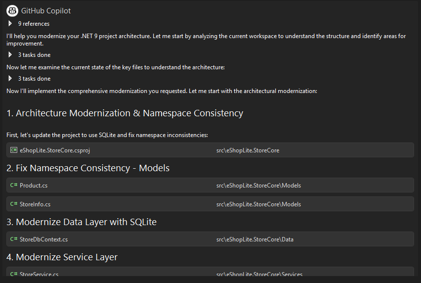

> 💡 **IMPORTANTE**
>
> Se a solicitação parar no meio de uma tarefa, você sempre pode pedir ao Copilot para continuar dizendo "continue" ou "please continue."

## 📝 Etapas de Modernização

O GitHub Copilot guiará você através de várias fases de modernização:

### 1️⃣ Namespace e Consistência de Nomenclatura

Devido à estrutura de namespace mais antiga do .NET Framework, precisamos garantir que todos os namespaces e convenções de nomenclatura estejam consistentes em nossa aplicação. Por exemplo, nossos models podem ter namespaces como `eShopLite.StoreFx.Models` em vez de `eShopLite.StoreCore.Models`.

Para alcançar isso, adicionamos etapas para o Copilot analisar seu código e sugerir correções de namespace. Antes de aceitar quaisquer mudanças, siga estas etapas:

**O que revisar:**

- ✅ Revise as mudanças sugeridas de namespace - você pode aceitar ou modificá-las conforme necessário
- ✅ Aceite modificações para alinhar com convenções e packages do .NET 9, como migrar de `Newtonsoft.Json` para `System.Text.Json`
- ✅ Garanta que todos os models sigam padrões de nomenclatura consistentes

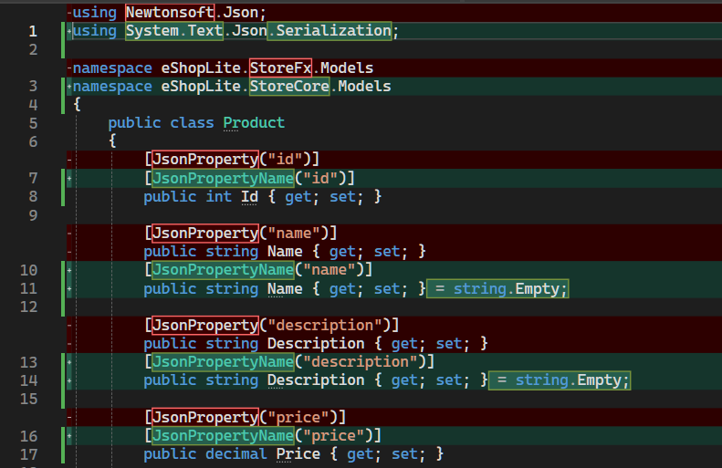

**Exemplo de mudanças:**

**Antes:**
```csharp
using Newtonsoft.Json;

namespace eShopLite.StoreFx.Models
{
    public class Product
    {
        [JsonProperty("id")]
        public int Id { get; set; }
    }
}
```

**Depois:**
```csharp
using System.Text.Json.Serialization;

namespace eShopLite.StoreCore.Models;

public class Product
{
    [JsonPropertyName("id")]
    public int Id { get; set; }
}
```

### 2️⃣ Modernização da Arquitetura

#### Modernizar Camada de Dados com SQLite

Estamos fazendo a transição de SQL Express usando InMemory para SQLite, usando assim um banco de dados real para persistência. O Copilot ajudará na transição:

**Mudanças principais:**

- Atualizar packages do Entity Framework Core
- Configurar o provider SQLite
- Ajustar connection strings

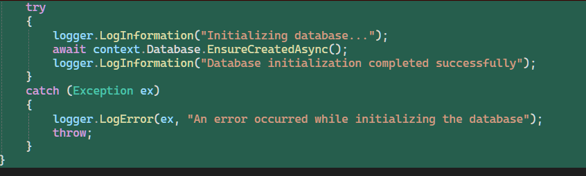

**Exemplo de configuração:**

**Program.cs:**
```csharp
builder.Services.AddDbContext<StoreContext>(options =>
    options.UseSqlite(builder.Configuration.GetConnectionString("DefaultConnection")));
```

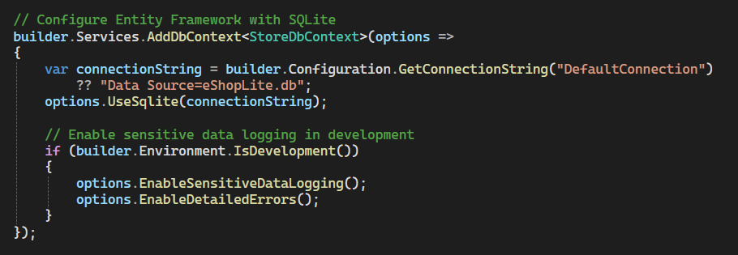

**appsettings.json:**
```json
{
  "ConnectionStrings": {
    "DefaultConnection": "Data Source=eShopLite.db"
  }
}
```

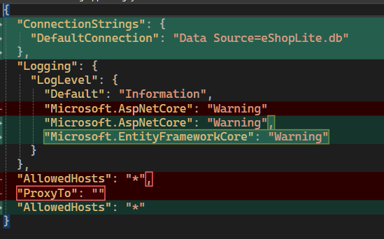

#### Injeção de Dependência, Async/Await, Roteamento Moderno

Transforme os serviços para usar padrões modernos de injeção de dependência e atualize controllers com padrões async/await e roteamento moderno.

**Antes (sem DI):**
```csharp
public class ProductController : Controller
{
    public ActionResult Index()
    {
        var service = new ProductService(); // ❌ Instanciação direta
        var products = service.GetProducts(); // ❌ Síncrono
        return View(products);
    }
}
```

**Depois (com DI e async):**
```csharp
public class ProductController : Controller
{
    private readonly IProductService _productService;

    public ProductController(IProductService productService) // ✅ DI
    {
        _productService = productService;
    }

    public async Task<IActionResult> Index() // ✅ Async
    {
        var products = await _productService.GetProductsAsync();
        return View(products);
    }
}
```

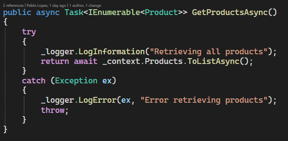

**Registrar serviços no Program.cs:**
```csharp
builder.Services.AddScoped<IProductService, ProductService>();
builder.Services.AddScoped<IOrderService, OrderService>();
```

### 3️⃣ Migração do Banco de Dados

O Copilot deve automaticamente lidar com a migração do banco de dados para SQLite, mas se não o fizer, você pode seguir estas etapas:

#### Criar Migração Inicial

1. Abra um terminal no diretório do projeto
2. Execute os seguintes comandos:

```bash
cd eShopLite.StoreCore
dotnet ef migrations add InitialCreate
```

Você verá uma saída similar a:
```
Build started...
Build succeeded.
Done. To undo this action, use 'dotnet ef migrations remove'
```

#### Aplicar Migração e Criar Banco de Dados

3. Agora, compile e execute a aplicação para garantir que o banco de dados seja criado e populado corretamente:

```bash
dotnet build
dotnet run
```

Ou simplesmente pressione `F5` no Visual Studio.

## 🔧 Solucionando Problemas Comuns

### Problema: Erros de YARP

Se você encontrar erros do YARP (Yet Another Reverse Proxy):

**Solução:**
- Peça ao Copilot para remover referências do YARP do seu projeto
- Geralmente não são necessárias para esta aplicação

```
@workspace Please remove YARP references from the project
```

### Problema: Imagens Não Aparecem

Se as imagens de produtos não aparecerem após a modernização:

**Solução:**
- Peça ao Copilot para reorganizar arquivos estáticos dentro da pasta `wwwroot`
- Garanta que os caminhos das imagens estejam corretamente referenciados

```
@workspace Images are not loading. Can you check and fix the static files organization?
```

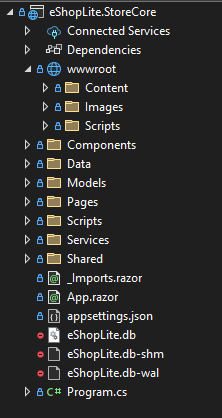

### Problema: Erros de Namespace

Se você encontrar erros de namespace após as mudanças:

**Solução:**
```
@workspace I have namespace errors in [arquivo]. Can you fix them?
```

## 🎯 Build e Teste

Após completar todas as etapas de modernização:

### 1. Compile a Solution

```bash
dotnet build
```

Ou no Visual Studio: `Ctrl+Shift+B`

**Verifique:**
- ✅ Build completa sem erros
- ✅ Apenas warnings aceitáveis (se houver)

### 2. Execute a Aplicação

```bash
dotnet run --project eShopLite.StoreCore
```

Ou no Visual Studio: `F5`

### 3. Teste as Funcionalidades

Verifique se:
- ✅ Operações de banco de dados funcionam com SQLite
- ✅ Todas as páginas carregam corretamente
- ✅ Imagens e conteúdo estático exibem adequadamente
- ✅ Operações assíncronas completam com sucesso
- ✅ Navegação funciona corretamente

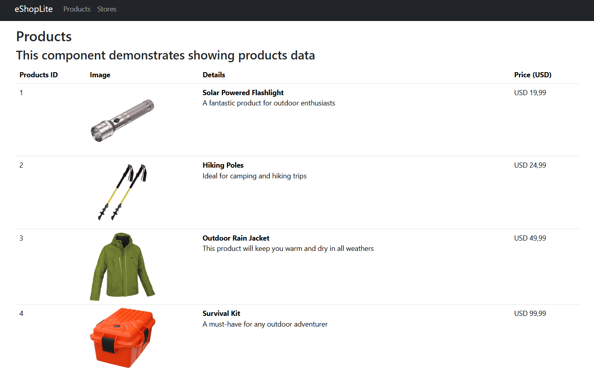

## 4️⃣ Converter para Páginas Blazor (Bônus)

Ótimo! Agora estamos prontos para continuar nossa jornada de modernização convertendo as páginas ASP.NET MVC existentes para componentes Blazor. Use o seguinte prompt para guiar o Copilot:

```plaintext
Convert the existing ASP.NET MVC pages to Blazor components. This includes:

Convert all existing pages to use Blazor (preferably Blazor Server or Blazor WebAssembly, depending on suitability).
Remove all non-Blazor pages and ensure routing is correctly configured.
Ensure all media (images, videos, etc.) are correctly referenced and rendered in the new Blazor components.
Fix issues where the page renders blank or fails to load due to routing or layout problems.
```


O Copilot converterá as páginas MVC para componentes Blazor, garantindo que toda a funcionalidade seja preservada e adicionando alguns novos recursos.

> 💡 **Nota**: Se encontrar quaisquer problemas com a migração Blazor, você pode pedir ajuda ao Copilot para solucionar problemas específicos, como componentes faltando ou erros de roteamento.

**Exemplo de conversão:**

**Antes (MVC View):**
```cshtml
@model IEnumerable<Product>

<h1>Products</h1>
<div class="row">
    @foreach (var product in Model)
    {
        <div class="col-md-4">
            <h3>@product.Name</h3>
            <p>@product.Price</p>
        </div>
    }
</div>
```

**Depois (Blazor Component):**
```razor
@page "/products"
@inject IProductService ProductService

<h1>Products</h1>
<div class="row">
    @foreach (var product in products)
    {
        <div class="col-md-4">
            <h3>@product.Name</h3>
            <p>@product.Price</p>
        </div>
    }
</div>

@code {
    private List<Product> products = new();

    protected override async Task OnInitializedAsync()
    {
        products = await ProductService.GetProductsAsync();
    }
}
```

### Resultado Final

Esta é nossa página final após a conversão para Blazor:

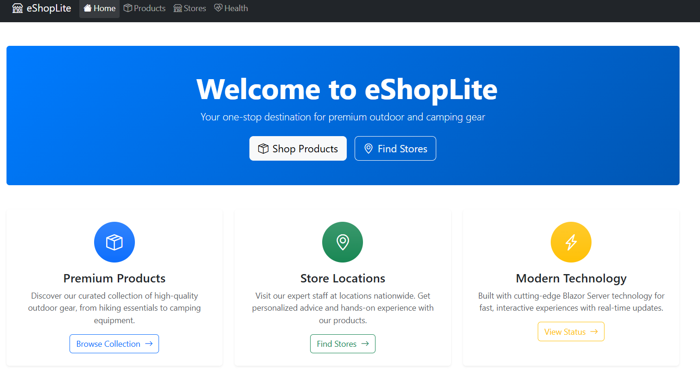

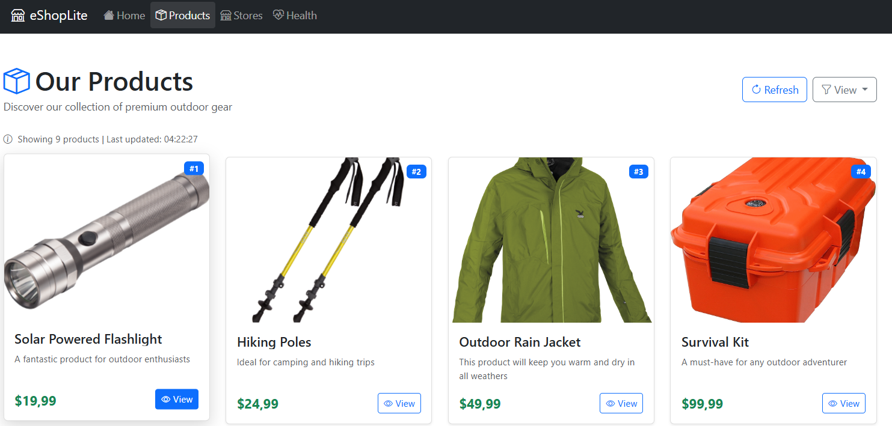

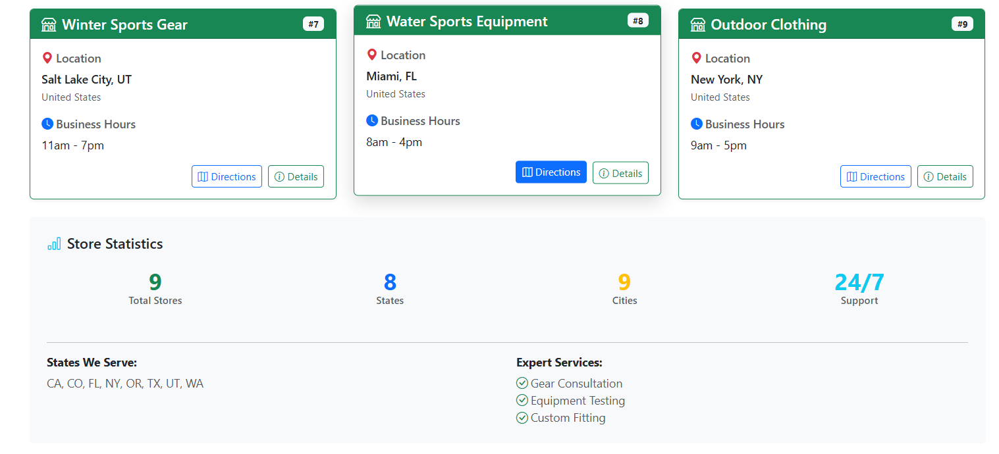

## ✅ Verificação

Ao final desta seção, você deve ter:

🔹 Aproveitado o GitHub Copilot para melhorias de código  
🔹 Aplicado padrões de codificação modernos  
🔹 Aprimorado a performance e manutenibilidade da aplicação  
🔹 Implementado injeção de dependência em toda a aplicação  
🔹 Migrado para SQLite com Entity Framework Core  
🔹 Convertido páginas MVC para componentes Blazor (opcional)  

## 💡 Melhores Práticas Aplicadas

Durante esta modernização, aplicamos várias melhores práticas:

### Padrões de Código

✅ **File-scoped namespaces**: Menos aninhamento, código mais limpo  
✅ **Async/await**: Operações não-bloqueantes para melhor performance  
✅ **Nullable reference types**: Mais segurança em tempo de compilação  
✅ **Dependency Injection**: Desacoplamento e testabilidade  

### Arquitetura

✅ **Separation of Concerns**: Camadas bem definidas (Data, Service, Controller)  
✅ **Interface-based design**: Melhor testabilidade e flexibilidade  
✅ **Modern routing**: Roteamento simplificado e consistente  

### Performance

✅ **Async operations**: Melhor uso de threads  
✅ **SQLite**: Banco de dados leve e eficiente  
✅ **Blazor**: Renderização eficiente e interatividade  

## 🎯 Pontos-Chave de Aprendizado

Você aprendeu:

✅ Como usar GitHub Copilot para modernização arquitetural  
✅ Aplicar padrões modernos do .NET 9  
✅ Migrar de SQL Express para SQLite  
✅ Implementar injeção de dependência  
✅ Converter MVC para Blazor  
✅ Resolver problemas comuns de modernização  

## ⏱️ Tempo Investido

Esta seção deve levar aproximadamente **30-40 minutos** para completar.

## ✅ Checkpoint

Antes de avançar, certifique-se de que:

- [ ] Todos os namespaces estão consistentes
- [ ] Injeção de dependência está implementada
- [ ] Aplicação usa SQLite
- [ ] Controllers são assíncronos
- [ ] Aplicação compila sem erros
- [ ] Todas as funcionalidades testadas funcionam
- [ ] (Opcional) Páginas convertidas para Blazor

## 🎯 Próximos Passos

Excelente trabalho! Sua aplicação agora não apenas roda no .NET 9, mas também segue padrões modernos de arquitetura e desenvolvimento.

Mas podemos ir ainda mais longe! Na próxima seção, vamos adicionar capacidades inteligentes à aplicação usando **Inteligência Artificial**, criando um chatbot que pode ajudar os clientes da sua loja.

---

**⏱️ Tempo estimado desta seção**: 30-40 minutos  
**✅ Checkpoint**: Aplicação modernizada com padrões do .NET 9

---

[← Voltar: Atualização do .NET](./02-atualizacao-dotnet.md) | [Próximo: Incorporando IA →](./04-incorporando-ia.md)
