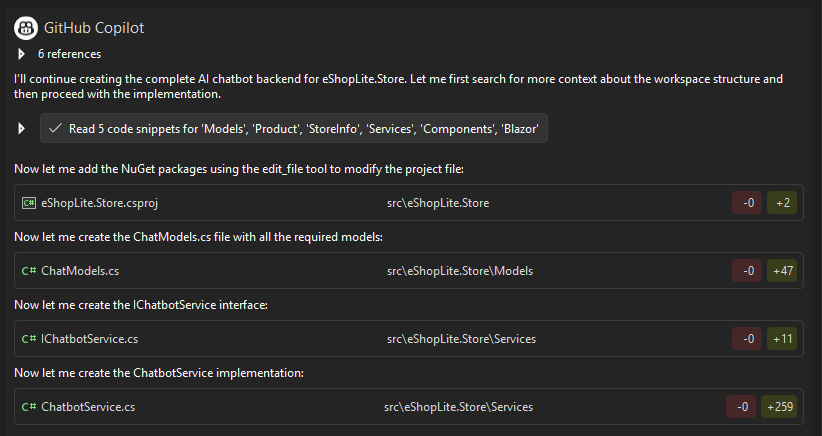
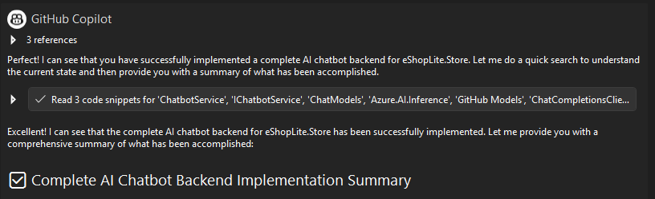
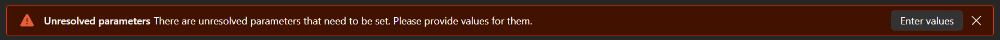
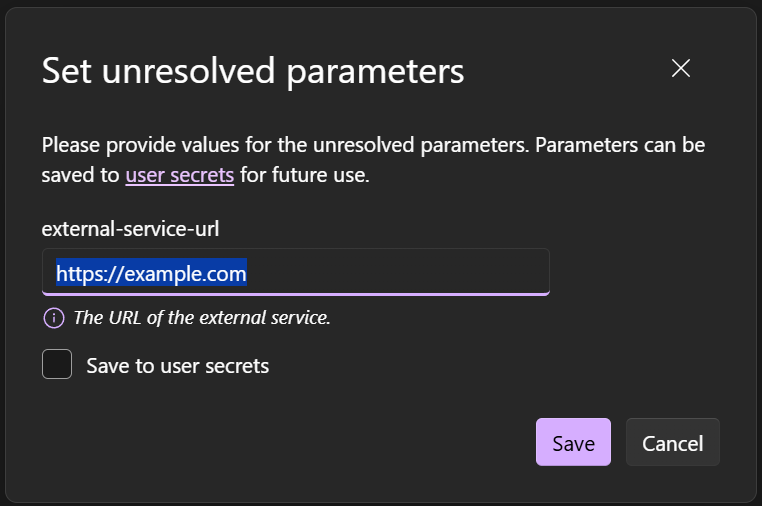
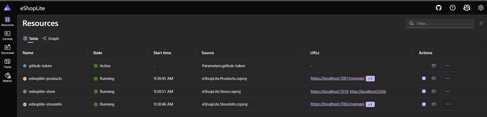
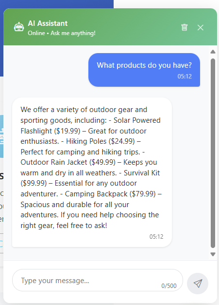

# 🧠 4. Incorporando IA

Aprimore sua aplicação com recursos inteligentes usando GitHub Models, trazendo inteligência artificial de ponta para sua solução eShopLite modernizada.


Transforme sua loja eShopLite em uma experiência de compras inteligente com um chatbot alimentado por IA que compreende seu catálogo de produtos e fornece assistência personalizada aos clientes.

## 📋 O que você vai fazer

Esta seção explora:

🤖 Integração do GitHub Models com Azure.AI.Inference  
💬 Implementação de chatbot alimentado por IA  
🛍️ Capacidades de conversação com conhecimento de produtos  
🔗 Conexão de serviços de IA à sua arquitetura de microserviços  
📱 Interface de chat flutuante moderna com componentes Blazor  
🔒 Gerenciamento seguro de tokens com .NET Aspire  
🛡️ Sistemas de fallback para disponibilidade do serviço de IA  

## 🚀 Entendendo a Arquitetura de Integração de IA

Nossa implementação de chatbot de IA segue uma arquitetura robusta para nossa aplicação eShopLite:

- **GitHub Models**: Aproveitando LLMs para respostas inteligentes, para prototipar com capacidades de IA!
- **Azure.AI.Inference**: SDK moderno para integração de serviços de IA
- **Integração do Catálogo de Produtos**: Respostas com contexto sobre o inventário da loja
- **Gerenciamento de Sessão**: Mantendo histórico de conversação e contexto

### Stack Técnico

- **Backend**: C# com SDK Azure.AI.Inference
- **Frontend**: Componentes Blazor Server com renderização interativa
- **Configuração**: Gerenciamento de parâmetros do .NET Aspire

## 🛠️ Guia de Implementação

### Preparação: Abrir o Projeto Inicial

Antes de começar a implementação, certifique-se de ter o projeto correto aberto:

1. **Localize o Projeto**

   Navegue até a pasta de amostras do workshop:
   ```
   translation/samples/04-ai-capabilities-start/
   ```
   
   > **💡 Dica**: Esta é uma cópia da amostra original localizada em `8-add-ai-capabilities/StartSample/`. Você também pode usar a amostra original se preferir.

2. **Abra a Solution**

   Abra o arquivo `eShopLite.sln` no Visual Studio.

3. **Explore a Estrutura**

   Você verá uma aplicação modernizada com arquitetura de microserviços usando .NET Aspire:
   - `eShopLite.AppHost`: Host do .NET Aspire
   - `eShopLite.Store`: Aplicação frontend Blazor (onde adicionaremos o chatbot)
   - `eShopLite.Products`: API de produtos
   - `eShopLite.StoreInfo`: API de informações da loja
   - `eShopLite.ServiceDefaults`: Configurações compartilhadas

4. **Verifique os Pré-requisitos**

   - ✅ GitHub Copilot instalado e ativado
   - ✅ .NET 9 SDK instalado
   - ✅ Docker Desktop rodando (para .NET Aspire)

Vamos usar o GitHub Copilot com prompts otimizados para simplificar a implementação do chatbot de IA. Esta abordagem aproveita o modo agente para criar soluções abrangentes com intervenção manual mínima.

### Etapa 1: Configuração Completa do Backend

Use este prompt abrangente para criar toda a infraestrutura do backend do chatbot de IA:



Use este prompt para criar os componentes do backend:

```
Create a complete AI chatbot backend for eShopLite.Store with these components:

1. Add NuGet packages:
   - Azure.AI.Inference --prerelease
   - Microsoft.Extensions.AI

2. Create Models/ChatModels.cs with:
   - ChatMessage (Id, Content, IsUser, Timestamp)
   - ChatRequest (Message, SessionId)
   - ChatResponse (Message, SessionId, IsSuccessful, ErrorMessage)
   - ChatSession (Id, Messages, CreatedAt, LastActivity)

3. Create Services/IChatbotService.cs and Services/ChatbotService.cs:
   - GitHub Models integration using endpoint: https://models.github.ai/inference
   - Model: gpt-4o-mini, Temperature: 0.7, MaxTokens: 500
   - Inject IProductApiClient for product awareness
   - Session management with ConcurrentDictionary
   - Conversation history (last 10 messages)
   - Fallback responses when AI unavailable using pattern matching
   - Methods: SendMessageAsync, GetChatHistoryAsync, ClearChatHistoryAsync

4. Update Program.cs:
   - Register ChatCompletionsClient as singleton with GitHub token from environment
   - Register IChatbotService as scoped
   - Handle missing token gracefully with fallback mode

Don't create any extra frontend before asked, focus on the backend part

Use this sample as template for connection: 
/*
Run this model in C#.

> dotnet add package Azure.AI.Inference --prerelease
*/
using Azure;
using Azure.AI.Inference;

// To authenticate with the model you will need to generate a personal access token (PAT) in your GitHub settings. 
// Create your PAT token by following instructions here: https://docs.github.com/en/authentication/keeping-your-account-and-data-secure/managing-your-personal-access-tokens
var credential = new AzureKeyCredential(System.Environment.GetEnvironmentVariable("GITHUB_TOKEN"));

var client = new ChatCompletionsClient(
    new Uri("https://models.github.ai/inference"),
    credential,
    new AzureAIInferenceClientOptions()););

var requestOptions = new ChatCompletionsOptions()
{
    Messages =
    {
        new ChatRequestSystemMessage(""),
        new ChatRequestUserMessage("Can you explain the basics of machine learning?"),
    },
    Model = "openai/o3-mini",
    Temperature = {temperature},
    MaxTokens = {max_tokens},

};

Response<ChatCompletions> response = client.Complete(requestOptions);
System.Console.WriteLine(response.Value.Content);
```

Este único prompt gerará todos os componentes backend necessários, incluindo modelos de dados, interfaces de serviço, implementação com integração de IA, gerenciamento de sessão e configuração de injeção de dependência.



> **Nota**: É possível que a IA crie alguns componentes de UI para testar o backend. Você pode ignorá-los por enquanto, pois focaremos primeiro na implementação do backend.

> **Nota**: As versões dos packages usadas no prompt podem não ser as mais recentes. Você pode atualizá-las para as versões mais recentes conforme necessário.

### Compreendendo os Componentes Backend

Vamos revisar os principais componentes que o Copilot criará:

#### Models/ChatModels.cs

```csharp
namespace eShopLite.Store.Models;

public class ChatMessage
{
    public string Id { get; set; } = Guid.NewGuid().ToString();
    public string Content { get; set; } = string.Empty;
    public bool IsUser { get; set; }
    public DateTime Timestamp { get; set; } = DateTime.UtcNow;
}

public class ChatRequest
{
    public string Message { get; set; } = string.Empty;
    public string SessionId { get; set; } = string.Empty;
}

public class ChatResponse
{
    public string Message { get; set; } = string.Empty;
    public string SessionId { get; set; } = string.Empty;
    public bool IsSuccessful { get; set; }
    public string? ErrorMessage { get; set; }
}

public class ChatSession
{
    public string Id { get; set; } = Guid.NewGuid().ToString();
    public List<ChatMessage> Messages { get; set; } = new();
    public DateTime CreatedAt { get; set; } = DateTime.UtcNow;
    public DateTime LastActivity { get; set; } = DateTime.UtcNow;
}
```

#### Services/ChatbotService.cs (Estrutura Principal)

```csharp
public class ChatbotService : IChatbotService
{
    private readonly ChatCompletionsClient _chatClient;
    private readonly IProductApiClient _productClient;
    private readonly ConcurrentDictionary<string, ChatSession> _sessions = new();

    public ChatbotService(
        ChatCompletionsClient chatClient,
        IProductApiClient productClient)
    {
        _chatClient = chatClient;
        _productClient = productClient;
    }

    public async Task<ChatResponse> SendMessageAsync(ChatRequest request)
    {
        // Obter ou criar sessão
        var session = GetOrCreateSession(request.SessionId);
        
        // Adicionar mensagem do usuário ao histórico
        session.Messages.Add(new ChatMessage 
        { 
            Content = request.Message, 
            IsUser = true 
        });

        // Preparar contexto com produtos
        var products = await _productClient.GetProductsAsync();
        
        // Chamar IA
        var response = await GetAIResponseAsync(request.Message, session, products);
        
        // Adicionar resposta ao histórico
        session.Messages.Add(new ChatMessage 
        { 
            Content = response, 
            IsUser = false 
        });

        return new ChatResponse
        {
            Message = response,
            SessionId = session.Id,
            IsSuccessful = true
        };
    }
}
```

### Etapa 2: Implementação Completa de Frontend e Aspire

Use este prompt para criar a interface de chat moderna:


**Prompt para Implementação do Frontend:**

```
Create a complete chat UI for eShopLite.Store:

1. Create Components/Shared/ChatWidget.razor with:
   - Floating green button (80px) in bottom-right with chat icon
   - Expandable chat window (400x550px) above button
   - Direct @inject IChatbotService (not HttpClient)
   - @rendermode="InteractiveServer"
   - Message bubbles (user right/blue, bot left/gray)
   - Input field with 500 char limit and send button
   - Typing indicator during processing
   - Clear chat button in header
   - All styles inline to avoid CSS scoping issues
   - Z-index: 9999 for proper overlay
   - Mobile responsive design

2. Update MainLayout.razor:
   - Add <ChatWidget @rendermode="InteractiveServer"/> at bottom
   - Ensure proper component placement

3. Update _Imports.razor:
   - Add @using eShopLite.Store.Components.Shared

Configure .NET Aspire integration
4. Update AppHost Program.cs:
   - Add parameter: builder.AddParameter("github-token", secret: true)
   - Pass to Store: .WithEnvironment("GITHUB_TOKEN", githubToken)
   - Configure service dependencies
```

Este prompt cria um widget de chat pronto para produção com UI/UX moderno, design responsivo e integração perfeita com sua aplicação Blazor.

#### Entendendo o Componente ChatWidget

**Estrutura do Componente:**

```razor
@inject IChatbotService ChatbotService
@rendermode InteractiveServer

<!-- Botão Flutuante -->
<div class="chat-button" @onclick="ToggleChat">
    <span>💬</span>
</div>

<!-- Janela de Chat -->
@if (isOpen)
{
    <div class="chat-window">
        <div class="chat-header">
            <h3>Assistente eShopLite</h3>
            <button @onclick="ClearChat">🗑️</button>
            <button @onclick="ToggleChat">❌</button>
        </div>
        
        <div class="chat-messages">
            @foreach (var message in messages)
            {
                <div class="message @(message.IsUser ? "user" : "bot")">
                    @message.Content
                </div>
            }
            @if (isTyping)
            {
                <div class="typing-indicator">
                    <span></span><span></span><span></span>
                </div>
            }
        </div>
        
        <div class="chat-input">
            <input @bind="userMessage" 
                   @bind:event="oninput"
                   @onkeypress="HandleKeyPress"
                   maxlength="500"
                   placeholder="Digite sua mensagem..." />
            <button @onclick="SendMessage">Enviar</button>
        </div>
    </div>
}

@code {
    private bool isOpen = false;
    private bool isTyping = false;
    private string userMessage = string.Empty;
    private List<ChatMessage> messages = new();
    private string sessionId = Guid.NewGuid().ToString();

    private async Task SendMessage()
    {
        if (string.IsNullOrWhiteSpace(userMessage)) return;

        isTyping = true;
        var request = new ChatRequest 
        { 
            Message = userMessage, 
            SessionId = sessionId 
        };
        
        userMessage = string.Empty;
        
        var response = await ChatbotService.SendMessageAsync(request);
        messages = await ChatbotService.GetChatHistoryAsync(sessionId);
        
        isTyping = false;
        StateHasChanged();
    }

    private void ToggleChat() => isOpen = !isOpen;
    
    private async Task ClearChat()
    {
        await ChatbotService.ClearChatHistoryAsync(sessionId);
        messages.Clear();
    }
}
```

### Etapa 3: Configurar Integração do .NET Aspire

Execute nossa aplicação para começar a usar o chatbot de IA. Precisamos configurar o .NET Aspire para gerenciamento seguro de token e dependências de serviço.

Siga estas etapas:

#### 1. Execute a Aplicação

Primeiro, execute a aplicação para gerar os arquivos de configuração iniciais:

```bash
dotnet run --project eShopLite.AppHost
```

Ou pressione `F5` no Visual Studio.

#### 2. Configure o Token do GitHub

Enquanto a aplicação estiver rodando, note a mensagem sobre parâmetros faltando. Isso indica que precisamos configurar nosso token do GitHub para acesso ao serviço de IA.



#### 3. Adicione o Token

Clique no parâmetro no dashboard do .NET Aspire para adicionar seu token do GitHub. Se você ainda não tem um token, siga as instruções para criar um nas configurações da sua conta GitHub [aqui](https://docs.github.com/pt/authentication/keeping-your-account-and-data-secure/managing-your-personal-access-tokens#creating-a-personal-access-token-classic).

**Criar Token do GitHub:**

1. Acesse [github.com/settings/tokens](https://github.com/settings/tokens)
2. Clique em **"Generate new token (classic)"**
3. Dê um nome descritivo (ex: "eShopLite AI Chatbot")
4. Selecione escopo: **Nenhum escopo específico é necessário** para GitHub Models
5. Defina expiração conforme sua preferência
6. Clique em **"Generate token"**
7. **Copie o token imediatamente** (não poderá vê-lo novamente!)

#### 4. Configure no Aspire

Adicione seu token do GitHub no dashboard do .NET Aspire em uma janela popup, que se parece com isso:



#### 5. Configuração Concluída

Pronto! A configuração está completa e sua aplicação pode acessar com segurança o GitHub Models para capacidades de IA. Seu dashboard agora deve mostrar o parâmetro como configurado:



## ✅ Verificação

Teste sua implementação de chatbot de IA:

### 1. Inicie a Aplicação

```bash
dotnet run --project eShopLite.AppHost
```

Ou pressione `F5` no Visual Studio.

### 2. Configure o Token

**No dashboard do Aspire**, certifique-se de que o token do GitHub está configurado corretamente. Clique na URL para abrir a aplicação Store no seu navegador.

### 3. Teste a Funcionalidade do Chat

Clique no botão verde de chat no canto inferior direito e experimente várias consultas:

#### Perguntas Sugeridas

**Sobre Produtos:**
```
Quais produtos vocês têm?
```

**Sobre Categorias:**
```
Me fale sobre equipamentos de camping
```

**Sobre Preços:**
```
Qual é o preço da lanterna?
```

**Saudações:**
```
Olá! Como você pode me ajudar?
```

**Recomendações:**
```
Estou planejando uma trilha. O que você recomenda?
```



### Comportamentos Esperados

✅ **Respostas Rápidas**: O chatbot deve responder em 2-3 segundos  
✅ **Consciente de Produtos**: Deve mencionar produtos reais da loja  
✅ **Contextual**: Deve lembrar mensagens anteriores na conversa  
✅ **Fallback Gracioso**: Se a IA estiver indisponível, deve fornecer respostas úteis padrão  
✅ **UI Responsiva**: Funciona bem em desktop e mobile  

## 🎉 O que você Conquistou

Sua loja eShopLite aprimorada com IA agora apresenta:

✅ **Assistente de Chat Inteligente**: Respostas alimentadas por IA usando GitHub Models  
✅ **Consciência de Produtos**: Recomendações contextuais do seu catálogo  
✅ **UI Moderna**: Interface de chat flutuante e responsiva  
✅ **Arquitetura Robusta**: Sistemas de fallback e tratamento de erros  
✅ **Configuração Segura**: Gerenciamento de tokens através do .NET Aspire  
✅ **Pronto para Produção**: Gerenciamento escalável de sessões e otimização de performance  

## 🎯 O que você Aprendeu

Nesta seção, você:

✅ Integrou GitHub Models com Azure.AI.Inference  
✅ Implementou um chatbot alimentado por IA do zero  
✅ Criou componentes Blazor interativos  
✅ Gerenciou configuração segura com .NET Aspire  
✅ Aplicou padrões de injeção de dependência  
✅ Construiu sistemas resilientes com fallbacks  

## 💡 Indo Além

### Melhorias Possíveis

**Funcionalidades Avançadas:**

1. **Histórico Persistente**: Salvar conversas no banco de dados
2. **Análise de Sentimento**: Detectar satisfação do cliente
3. **Integração com Pedidos**: Permitir fazer pedidos via chat
4. **Multi-idioma**: Suporte para múltiplos idiomas
5. **Voice Input**: Adicionar capacidade de entrada por voz
6. **Feedback Loop**: Coletar feedback sobre respostas da IA

**Otimizações:**

1. **Caching**: Cache de respostas comuns
2. **Rate Limiting**: Limitar número de mensagens por usuário
3. **Streaming**: Respostas em streaming para UX mais rápida
4. **Analytics**: Rastrear métricas de uso do chatbot

### Modelos Alternativos

O GitHub Models oferece vários modelos LLM:

- **GPT-4o**: Modelo mais capaz, mais lento e mais caro
- **GPT-4o-mini**: Balanceado (padrão deste workshop)
- **GPT-3.5-turbo**: Mais rápido, menos capaz
- **Modelos Especializados**: Para tarefas específicas

Para mudar o modelo, ajuste no `ChatbotService.cs`:

```csharp
var requestOptions = new ChatCompletionsOptions()
{
    Model = "gpt-4o", // Mude aqui
    Temperature = 0.7,
    MaxTokens = 500,
    // ...
};
```

## ⏱️ Tempo Investido

Esta seção deve levar aproximadamente **20-25 minutos** para completar.

## ✅ Checkpoint

Antes de finalizar, certifique-se de que:

- [ ] Chatbot responde corretamente a perguntas
- [ ] UI do chat é responsiva e funcional
- [ ] Token do GitHub configurado no Aspire
- [ ] Integração com catálogo de produtos funciona
- [ ] Fallbacks funcionam quando IA está indisponível
- [ ] Aplicação compila e executa sem erros

## 🎯 Conclusão

Parabéns! Você transformou com sucesso uma aplicação legada do .NET Framework em uma solução moderna e inteligente alimentada por IA!

Sua jornada incluiu:
- ⬆️ Upgrade de .NET Framework para .NET 9
- 🏗️ Modernização da arquitetura e padrões
- 🤖 Refatoração assistida por GitHub Copilot
- 🧠 Integração de capacidades de IA

Sua aplicação agora representa uma transformação completa: de um monólito legado do .NET Framework para uma solução de microserviços moderna e aprimorada com IA, pronta para deploy!

---

**⏱️ Tempo estimado desta seção**: 20-25 minutos  
**✅ Checkpoint**: Chatbot de IA funcionando e integrado

---

[← Voltar: Modernização com Copilot](./03-modernizacao-copilot.md) | [Próximo: Considerações Finais →](./05-consideracoes-finais.md)
